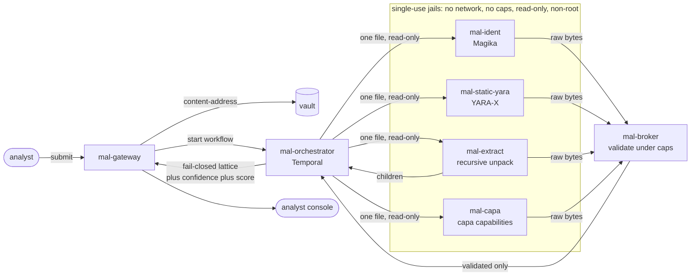
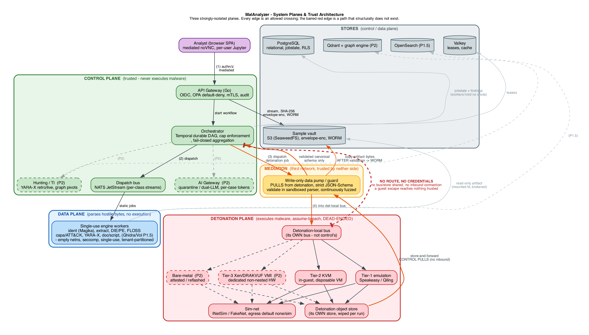

<div align="center">

<picture>
  <source media="(prefers-color-scheme: dark)" srcset="docs/brand/openmallab-logo.png" />
  
</picture>

# OpenMalLab

**The sovereign, all-in-one malware analysis platform.**

Air-gap-first. Containment-first. Every verdict backed by evidence you can read.

<p>
  <a href="https://github.com/COLONAYUSH/OpenMalLab/actions/workflows/ci.yml"></a>
  <a href="LICENSE"></a>
  
  
</p>

<p>
  
  
  
  
  
  
  
</p>

<a href="#quickstart"><b>Quickstart</b></a> &nbsp;&bull;&nbsp;
<a href="#how-it-works"><b>How it works</b></a> &nbsp;&bull;&nbsp;
<a href="#the-containment-model"><b>Containment</b></a> &nbsp;&bull;&nbsp;
<a href="#the-engines"><b>Engines</b></a> &nbsp;&bull;&nbsp;
<a href="#roadmap"><b>Roadmap</b></a> &nbsp;&bull;&nbsp;
<a href="docs/ARCHITECTURE.md"><b>Design</b></a>

</div>

---

OpenMalLab takes a suspicious file and tells you what it really is, with the evidence to back every word, without ever letting the file touch anything it should not. It runs fully offline, it is self-hostable, and it is built so that the malware you are studying can never reach out of the box you put it in.

Most of what you need to analyze malware already exists. The problem is it lives in thirty different tools, half of them cloud-only and priced for enterprises, the other half single-purpose projects you stitch together yourself. Uploading a sample to a cloud service tips off the adversary and leaks your data. Nobody has fused deep static analysis, capability detection, and an explainable verdict into one self-hostable product you can run in an air-gapped lab, with a containment story you would stake your network on. That is what we are building, and the static core already runs.

> [!IMPORTANT]
> We do not reinvent the engines. We take the best open tools in the world (Google's Magika, VirusTotal's YARA-X, Mandiant's capa) and fuse them into one platform, each running inside a zero-trust jail we built around them. Best-of-breed detection, sovereign plumbing.

## Contents

- [Highlights](#highlights)
- [Quickstart](#quickstart)
- [How it works](#how-it-works)
- [The containment model](#the-containment-model)
- [The engines](#the-engines)
- [The analyst console](#the-analyst-console)
- [Roadmap](#roadmap)
- [Tech stack](#tech-stack)
- [Repo layout](#repo-layout)
- [Design docs](#design-docs)
- [Contributing](#contributing) . [Security](#security) . [License](#license)

## Highlights

- **Containment is the product, not a setting.** Every engine that touches hostile bytes runs as a single-use container with no network, no capabilities, a read-only root, a non-root user, and exactly one file mounted read-only.
- **Best-of-breed engines, fused.** Magika for content-based identification, YARA-X for signatures, capa for ATT&CK-mapped capabilities, and a recursive archive unpacker, all behind one contract.
- **Fail closed, always.** No file comes back clean because analysis got interrupted, capped, or crashed. Unknown is not benign. A crash raises suspicion, it never lowers it.
- **A verdict you can rank and read.** Severity and confidence are separate axes, so a real signature hit outranks a crashed engine even though both are "suspicious." Every point of the score traces to the finding that earned it.
- **Recursive by design.** A zip inside a zip inside an email is walked to the bottom, each artifact re-analyzed, every finding tagged with the breadcrumb path back to the root.
- **Air-gap-first, not air-gap-eventually.** Zero mandatory external calls. Every image builds hermetically; every model and rule set is pinned by hash into the image.

## Quickstart

> [!NOTE]
> Requires Docker with the Compose plugin. Everything runs locally, offline. First build compiles the jailed engine images; later runs are cached.

```bash
git clone https://github.com/COLONAYUSH/OpenMalLab
cd OpenMalLab

# build the jailed engine images and bring up the control node
docker compose -f deploy/compose.yaml --profile build build
docker compose -f deploy/compose.yaml up -d

# submit a file and get a verdict back
curl -s -F "file=@/path/to/sample" http://localhost:8080/v1/submissions
# -> {"submission_id":"sub-...","sha256":"...","status":"accepted"}

curl -s http://localhost:8080/v1/submissions/sub-xxxxxxxx | jq
```

A real round-trip, from the end-to-end proof (`deploy/proof/e2e.sh`):

```jsonc
{
  "verdict": "MALICIOUS",
  "score": 95,
  "confidence": "HIGH",
  "file_type": "php",
  "findings": [
    { "engine": "mal-ident",       "type": "file-type", "detail": "php",                            "verdict": "UNKNOWN" },
    { "engine": "mal-static-yara", "type": "yara",      "detail": "webshell_php_eval_superglobal", "verdict": "MALICIOUS", "attck": "T1505.003", "confidence": "HIGH" }
  ]
}
```

> [!TIP]
> Submit a zip that hides EICAR two directories deep and it comes back `MALICIOUS` with the breadcrumb `payloads/inner/eicar.com`. Submit a benign text file and it comes back `UNKNOWN`, score `0`, because nothing has earned the right to call it clean.

## How it works

A submission is walked as a tree, breadth-first, under hard depth and count caps. Each artifact is identified, scanned, and unpacked in parallel jails; executables also get capability analysis. Nothing an engine emits is trusted until a jailed broker has validated it, and the whole thing rolls up on a fail-closed lattice.



1. **Identify** what the file actually is with Magika, never trusting the extension.
2. **Scan** it with YARA-X against a curated, self-describing rule pack.
3. **Unpack** it recursively, with streaming caps so a decompression bomb stops cold and a Zip Slip goes nowhere, then re-submit every child through the whole pipeline.
4. **Characterize** executables with capa, mapping behavior to MITRE ATT&CK and MBC.
5. **Validate** every engine's raw output inside a jailed broker before a single byte reaches a trusted decoder.
6. **Roll up** a deterministic verdict on the lattice, with an orthogonal confidence and a 0-100 triage score, every point tracing to its evidence.

The platform is three strongly isolated planes. A trusted control plane that never parses raw hostile bytes in a privileged process, a data plane that parses hostile bytes but cannot execute them or reach the network, and (in Phase 2) a detonation plane that is physically dead-ended.

<div align="center">
  
</div>

## The containment model

This is a tool that eats hostile input for a living, so its own security is the first feature, not the last. The jail below is enforced by the orchestrator on every engine.

| Control | What it means |
|---|---|
| `--network none` | No interface but loopback, no routes. Network access is impossible, not merely blocked. |
| `--cap-drop ALL` + `no-new-privileges` | Zero Linux capabilities, no privilege escalation. |
| read-only root + `noexec` scratch | The worker cannot write its root or execute anything it drops in scratch. |
| non-root (`65534`) | Nothing runs as root inside the jail. |
| one file, read-only | The sample is the only thing mounted, addressed by its sha256. |
| the broker | Raw engine output is validated (one document, known fields, hard caps) inside its own jail before any trusted process decodes it. |
| fail closed | A crash, timeout, cap, or malformed result floors the node to SUSPICIOUS and flags it incomplete, never clean. |
| re-hash on ingest | Extracted children are re-hashed by the trusted side; a worker can never smuggle bytes under a hash they do not match. |

> [!WARNING]
> A 48-check boundary proof (`deploy/proof/boundary-proof.sh`) runs in CI and asserts every one of these properties against a live jail. If a change ever loosens the containment, the build goes red before it can merge.

<details>
<summary><b>The full threat model</b></summary>

<br />

The design survived three rounds of adversarial review, including an eight-lens pass that tried hard to break it. Every finding and its disposition is recorded.

- [docs/THREAT-MODEL.md](docs/THREAT-MODEL.md) - STRIDE per boundary, attack trees, and an honest residual-risk register.
- [docs/ARCHITECTURE-REVIEW.md](docs/ARCHITECTURE-REVIEW.md) - the round-3 review and every disposition.

We do not claim it is bulletproof. We claim there is no silent path, every residual risk is named and owned, and the big claims are gated behind an external pen test before we make them.

</details>

## The engines

Each engine is a best-of-breed open tool, wrapped as a jailed worker that speaks one bounded contract. We integrate; we do not reimplement.

| Engine | Upstream | Role | License | Status |
|---|---|---|---|:---:|
| `mal-ident` | [Magika](https://github.com/google/magika) (Google) | Content-based file identification, never the extension | Apache-2.0 | Live |
| `mal-static-yara` | [YARA-X](https://github.com/VirusTotal/yara-x) (VirusTotal) | Signatures via a curated, self-describing rule pack | BSD-3 | Live |
| `mal-extract` | pure-Rust `zip` / `tar` / `flate2` | Recursive, bomb-safe, Zip-Slip-proof unpacking | MIT / Apache-2.0 | Live |
| `mal-capa` | [capa](https://github.com/mandiant/capa) (Mandiant) | ATT&CK / MBC capability detection | Apache-2.0 | Live |
| `mal-static-die` | [Detect It Easy](https://github.com/horsicq/Detect-It-Easy) | Packer / compiler / crypto fingerprinting | MIT | Next |
| `mal-static-floss` | [FLOSS](https://github.com/mandiant/flare-floss) (Mandiant) | Deobfuscated and decoded strings | Apache-2.0 | Next |
| config extraction | [MACO](https://github.com/CybercentreCanada/maco) + configextractor-py | Normalized family config / C2 extraction | MIT | Planned |

Rules and models are vendored into each image and pinned by hash, so the image digest pins the exact detection content and nothing is fetched at run time. Operators drop their own rule packs into a documented slot for offline builds.

## The analyst console

A dark, forensic, read-only triage front end: a severity-striped queue ranked by verdict then score, and a detail pane with a circular score gauge over the recursive evidence tree (breadcrumb paths, findings grouped by engine, ATT&CK chips). It is fully self-contained and air-gap-clean (no external fonts, scripts, or calls), theme-aware, and every specimen-derived string is inert-rendered and defanged, because the console is itself a hostile-content surface. Source in [`services/mal-web/`](services/mal-web/).

## Roadmap

We build in phases, and each phase is a real product on its own.

**Phase 1 - the static wedge** (now, and largely running)

- [x] The containment model, the broker, the fail-closed lattice
- [x] Magika content-based identification
- [x] YARA-X with a real, self-describing rule pack
- [x] Recursive, bomb-safe extraction
- [x] capa ATT&CK / MBC capability detection
- [x] Confidence axis and 0-100 triage score
- [x] The read-only analyst console
- [ ] DIE and FLOSS
- [ ] MACO config / family extraction
- [ ] Real vault crypto, WORM audit, OIDC, persistence, the live queue API

**Phase 1.5** - Ghidra as a crash-isolated service, full Volatility memory forensics, an interactive analyst view, full-text search at scale, the first quarantined local-AI extraction.

**Phase 2** - the detonation plane: multi-tier, anti-evasion, and physically dead-ended so a full escape reaches nothing. Hunting and retrohunt over your own corpus, code-reuse attribution, a threat-intel graph, case management, a guardrailed AI assistant, and hard multi-tenancy.

**Phase 3** - the frontier: sound LLM-plus-IR script deobfuscation, a generic unpacker, symbolic execution, a STIX knowledge graph, and a natural-language investigation agent scoped tightly to one case.

Why detonation is Phase 2 and not Phase 1 is in [docs/DECISION-LOG.md](docs/DECISION-LOG.md).

## Tech stack

Chosen for correctness, offline operability, and a permissive-license core.

- **Orchestration:** Temporal for durable workflows, retries, timeouts, and safe recursion.
- **Languages:** Rust at the hostile-input boundary, Go for the control plane, Python for the heavier analysis engines, HTML/CSS/JS for the console.
- **State, kept deliberately small:** PostgreSQL, Temporal, SeaweedFS for object storage, OpenBao for secrets.
- **Isolation:** every engine is a jailed, single-use sibling container spawned per submission; the orchestrator is the only writer of the stores.

## Repo layout

```text
services/
  mal-gateway/       Go    submit + read API, content-addressed vault
  mal-orchestrator/  Go    Temporal workflows, the jail spawner, recursion caps, aggregation
  mal-ident/         Rust  Magika file identification
  mal-extract/       Rust  recursive, bomb-safe, path-safe unpacking
  mal-static-yara/   Rust  YARA-X with a self-describing rule pack
  mal-capa/          Py    capa capability detection
  mal-broker/        Go    the trust-boundary validator
  mal-web/           web   the read-only analyst console
internal/pipeline/   the shared verdict lattice, confidence, and score
deploy/              docker compose for the control node, plus the boundary and e2e proofs
docs/                the full, frozen, reviewed design
```

## Design docs

<details>
<summary><b>The whole plan, frozen and reviewed</b></summary>

<br />

- [docs/ARCHITECTURE.md](docs/ARCHITECTURE.md) - the ADRs: the three-plane model, containment, orchestration, storage, licensing.
- [docs/PHASE1-TECHNICAL-DESIGN.md](docs/PHASE1-TECHNICAL-DESIGN.md) - the buildable Phase 1: component contracts, fail-closed invariants, the adversarial corpus.
- [docs/THREAT-MODEL.md](docs/THREAT-MODEL.md) - STRIDE per boundary, attack trees, residual-risk register.
- [docs/ARCHITECTURE-REVIEW.md](docs/ARCHITECTURE-REVIEW.md) - the round-3 eight-lens adversarial review and every disposition.
- [docs/DECISION-LOG.md](docs/DECISION-LOG.md) - the build decisions and why we cut Phase 1 the way we did.
- [docs/LICENSING-BRIEF.md](docs/LICENSING-BRIEF.md) - how the Apache core stays clean next to copyleft engines.
- [docs/diagrams/](docs/diagrams/) - the rendered system diagrams and how to rebuild them.

</details>

## Contributing

Pull requests are welcome. See [CONTRIBUTING.md](CONTRIBUTING.md). The one rule that does not bend: build the hostile boundary first, and never weaken it. Every change to the jail has to keep the boundary proof green.

## Security

> [!CAUTION]
> Found a vulnerability? Report it privately per [SECURITY.md](SECURITY.md). Never attach live samples to an issue or a report. Reference everything by hash.

## License

Apache-2.0 for the core. Copyleft engines, when they arrive in later phases, run as process-isolated, separately-licensed components, never linked into the core. See [docs/LICENSING-BRIEF.md](docs/LICENSING-BRIEF.md).

## Acknowledgements

OpenMalLab stands on the work of the teams behind [Magika](https://github.com/google/magika), [YARA-X](https://github.com/VirusTotal/yara-x), [capa](https://github.com/mandiant/capa), [FLOSS](https://github.com/mandiant/flare-floss), [Detect It Easy](https://github.com/horsicq/Detect-It-Easy), [MACO](https://github.com/CybercentreCanada/maco), and [Temporal](https://github.com/temporalio/temporal). We are grateful for it, and we credit it loudly.

---

<div align="center">

### Star history

<a href="https://star-history.com/#COLONAYUSH/OpenMalLab&Date">
  
</a>

<br /><br />
<sub>Built in the open. Containment-first, from commit one.</sub>

</div>
