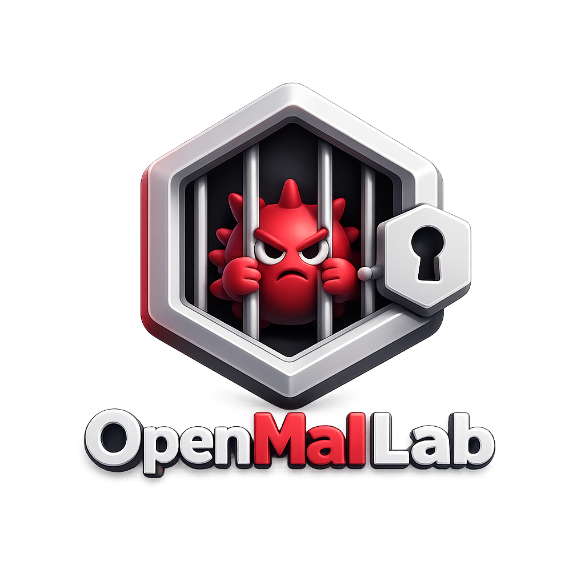
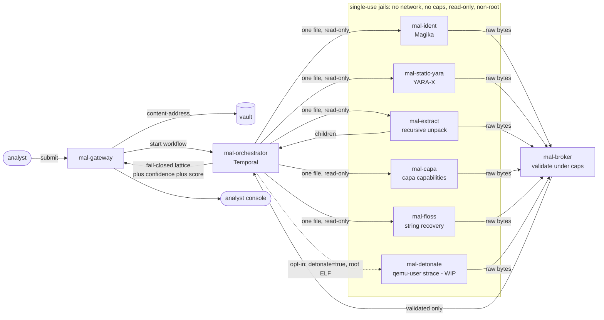
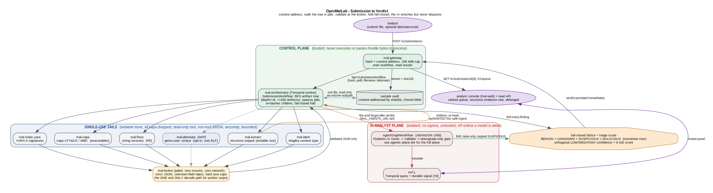
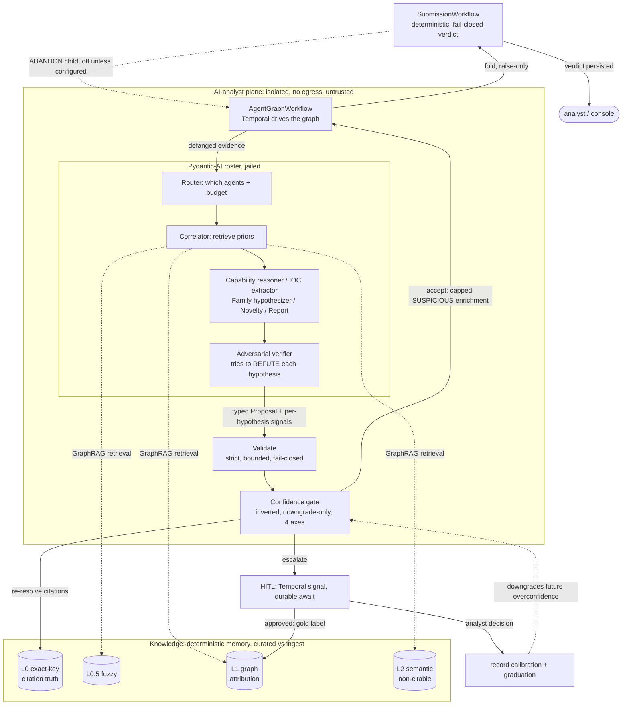
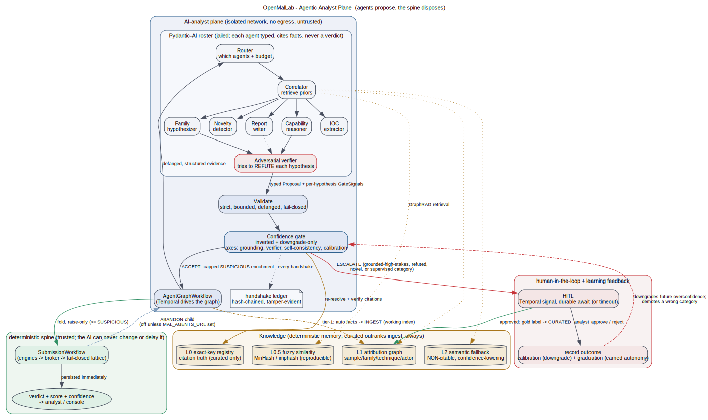

<div align="center">



# OpenMalLab

**The sovereign, all-in-one malware analysis platform.**

Air-gap-first. Containment-first. Every verdict backed by evidence you can read.

<p>
  <a href="https://github.com/COLONAYUSH/OpenMalLab/actions/workflows/ci.yml"></a>
  <a href="LICENSE"></a>
  
  
</p>

<p>
  
  
  
  
  
  
  
</p>

<a href="#quickstart"><b>Quickstart</b></a> &nbsp;&bull;&nbsp;
<a href="#how-it-works"><b>How it works</b></a> &nbsp;&bull;&nbsp;
<a href="#the-containment-model"><b>Containment</b></a> &nbsp;&bull;&nbsp;
<a href="#the-engines"><b>Engines</b></a> &nbsp;&bull;&nbsp;
<a href="#roadmap"><b>Roadmap</b></a> &nbsp;&bull;&nbsp;
<a href="docs/ARCHITECTURE.md"><b>Design</b></a>

</div>

---

OpenMalLab takes a suspicious file and tells you what it really is, with the evidence to back every word, without ever letting the file touch anything it should not. It runs fully offline, it is self-hostable, and it is built so that the malware you are studying can never reach out of the box you put it in.

Most of what you need to analyze malware already exists. The problem is it lives in thirty different tools, half of them cloud-only and priced for enterprises, the other half single-purpose projects you stitch together yourself. Uploading a sample to a cloud service tips off the adversary and leaks your data. Nobody has fused deep static analysis, capability detection, and an explainable verdict into one self-hostable product you can run in an air-gapped lab, with a containment story you would stake your network on. That is what we are building, and the static core already runs.

> [!IMPORTANT]
> We do not reinvent the engines. We take the best open tools in the world (Google's Magika, VirusTotal's YARA-X, Mandiant's capa) and fuse them into one platform, each running inside a zero-trust jail we built around them. Best-of-breed detection, sovereign plumbing.

## Contents

- [Highlights](#highlights)
- [Quickstart](#quickstart)
- [How it works](#how-it-works)
- [The containment model](#the-containment-model)
- [The engines](#the-engines)
- [The analyst console](#the-analyst-console)
- [Dynamic analysis](#dynamic-analysis-wip)
- [The agentic analyst](#the-agentic-analyst)
- [Roadmap](#roadmap)
- [Tech stack](#tech-stack)
- [Repo layout](#repo-layout)
- [Design docs](#design-docs)
- [Contributing](#contributing) . [Security](#security) . [License](#license)

## Highlights

- **Containment is the product, not a setting.** Every engine that touches hostile bytes runs as a single-use container with no network, no capabilities, a read-only root, a non-root user, and exactly one file mounted read-only.
- **Best-of-breed engines, fused.** Magika for content-based identification, YARA-X for signatures, capa for ATT&CK-mapped capabilities, FLOSS for string recovery, and a recursive archive unpacker, all behind one contract.
- **Fail closed, always.** No file comes back clean because analysis got interrupted, capped, or crashed. Unknown is not benign. A crash raises suspicion, it never lowers it.
- **A verdict you can rank and read.** Severity and confidence are separate axes, so a real signature hit outranks a crashed engine even though both are "suspicious." Every point of the score traces to the finding that earned it.
- **Recursive by design.** A zip inside a zip inside an email is walked to the bottom, each artifact re-analyzed, every finding tagged with the breadcrumb path back to the root.
- **A caged AI analyst that compounds.** A multi-agent layer proposes families, behaviors, and IOCs and learns from every sample into an on-premise knowledge graph - but it is jailed, brokered, and fail-closed like any engine: it cites spine-verified facts or it escalates, it earns autonomy on a track record, and it can never move a verdict by itself.
- **Air-gap-first, not air-gap-eventually.** Zero mandatory external calls. Every image builds hermetically; every model and rule set is pinned by hash into the image. The AI plane is local-default and off unless a model is wired.

## Quickstart

> [!NOTE]
> Requires Docker with the Compose plugin. Everything runs locally, offline. First build compiles the jailed engine images; later runs are cached.

```bash
git clone https://github.com/COLONAYUSH/OpenMalLab
cd OpenMalLab

# build the jailed engine images and bring up the control node
docker compose -f deploy/compose.yaml --profile build build
docker compose -f deploy/compose.yaml up -d

# submit a file and get a verdict back
curl -s -F "file=@/path/to/sample" http://localhost:8080/v1/submissions
# -> {"submission_id":"sub-...","sha256":"...","status":"accepted"}

curl -s http://localhost:8080/v1/submissions/sub-xxxxxxxx | jq
```

Want the **whole platform live** - the deterministic engines plus the AI-analyst
plane connected to a model (local + air-gapped, or a guarded cloud endpoint)? Follow
the basic-to-end walkthrough in [`docs/LIVE-GUIDE.md`](docs/LIVE-GUIDE.md) (quick
reference: [`deploy/RUNBOOK.md`](deploy/RUNBOOK.md)). In short: `make live`, then
`make e2e-live` to prove the full submit -> verdict -> AI enrichment -> human-review
loop.

A real round-trip, from the end-to-end proof (`deploy/proof/e2e.sh`):

```jsonc
{
  "verdict": "MALICIOUS",
  "score": 95,
  "confidence": "HIGH",
  "file_type": "php",
  "findings": [
    { "engine": "mal-ident",       "type": "file-type", "detail": "php",                            "verdict": "UNKNOWN" },
    { "engine": "mal-static-yara", "type": "yara",      "detail": "webshell_php_eval_superglobal", "verdict": "MALICIOUS", "attck": "T1505.003", "confidence": "HIGH" }
  ]
}
```

> [!TIP]
> Submit a zip that hides EICAR two directories deep and it comes back `MALICIOUS` with the breadcrumb `payloads/inner/eicar.com`. Submit a benign text file and it comes back `UNKNOWN`, score `0`, because nothing has earned the right to call it clean.

## How it works

A submission is walked as a tree, breadth-first, under hard depth and count caps. Each artifact is identified, scanned, and unpacked in parallel jails; executables also get capability analysis, and PEs get string recovery. Nothing an engine emits is trusted until a jailed broker has validated it, and the whole thing rolls up on a fail-closed lattice.



1. **Identify** what the file actually is with Magika, never trusting the extension.
2. **Scan** it with YARA-X against a curated, self-describing rule pack.
3. **Unpack** it recursively, with streaming caps so a decompression bomb stops cold and a Zip Slip goes nowhere, then re-submit every child through the whole pipeline.
4. **Characterize** executables with capa, mapping behavior to MITRE ATT&CK and MBC.
5. **Recover** strings from PEs with FLOSS, including stack, tight, and emulation-decoded strings that a flat scan would miss.
6. **Validate** every engine's raw output inside a jailed broker before a single byte reaches a trusted decoder.
7. **Roll up** a deterministic verdict on the lattice, with an orthogonal confidence and a 0-100 triage score, every point tracing to its evidence.

Optionally, when a submission is sent with `detonate=true`, a root-level ELF is also **detonated** as data under a jailed `qemu-user` emulator and its syscall trace mined into behavioral findings. This is the first dynamic-analysis slice ([see below](#dynamic-analysis-wip)); it caps at SUSPICIOUS like every other engine and never touches the deterministic verdict's floor.

The platform is built as strongly isolated planes: a trusted control plane that never parses raw hostile bytes in a privileged process, and a data plane that parses hostile bytes but cannot execute them or reach the network. The eventual, physically-segregated detonation plane is the Phase 3 design; the dynamic slice that ships today runs on the same single-use jail recipe as every static engine.

<div align="center">
  
</div>

<sub>Source: <a href="docs/diagrams/pipeline.dot"><code>docs/diagrams/pipeline.dot</code></a>. The multi-tier north-star architecture (the numbered <a href="docs/diagrams/">diagram set</a>) is the long-term design, not the current deployment.</sub>

## The containment model

This is a tool that eats hostile input for a living, so its own security is the first feature, not the last. The jail below is enforced by the orchestrator on every engine.

| Control | What it means |
|---|---|
| `--network none` | No interface but loopback, no routes. Network access is impossible, not merely blocked. |
| `--cap-drop ALL` + `no-new-privileges` | Zero Linux capabilities, no privilege escalation. |
| read-only root + `noexec` scratch | The worker cannot write its root or execute anything it drops in scratch. |
| non-root (`65534`) | Nothing runs as root inside the jail. |
| one file, read-only | The sample is the only thing mounted, addressed by its sha256. |
| the broker | Raw engine output is validated (one document, known fields, hard caps) inside its own jail before any trusted process decodes it. |
| fail closed | A crash, timeout, cap, or malformed result floors the node to SUSPICIOUS and flags it incomplete, never clean. |
| re-hash on ingest | Extracted children are re-hashed by the trusted side; a worker can never smuggle bytes under a hash they do not match. |

> [!WARNING]
> A 48-check boundary proof (`deploy/proof/boundary-proof.sh`) runs in CI and asserts every one of these properties against a live jail. If a change ever loosens the containment, the build goes red before it can merge.

<details>
<summary><b>The full threat model</b></summary>

<br />

The design survived three rounds of adversarial review, including an eight-lens pass that tried hard to break it. Every finding and its disposition is recorded.

- [docs/THREAT-MODEL.md](docs/THREAT-MODEL.md) - STRIDE per boundary, attack trees, and an honest residual-risk register.
- [docs/ARCHITECTURE-REVIEW.md](docs/ARCHITECTURE-REVIEW.md) - the round-3 review and every disposition.

We do not claim it is bulletproof. We claim there is no silent path, every residual risk is named and owned, and the big claims are gated behind an external pen test before we make them.

</details>

## The engines

Each engine is a best-of-breed open tool, wrapped as a jailed worker that speaks one bounded contract. We integrate; we do not reimplement.

| Engine | Upstream | Role | License | Status |
|---|---|---|---|:---:|
| `mal-ident` | [Magika](https://github.com/google/magika) (Google) | Content-based file identification, never the extension | Apache-2.0 | Live |
| `mal-static-yara` | [YARA-X](https://github.com/VirusTotal/yara-x) (VirusTotal) | Signatures via a curated, self-describing rule pack | BSD-3 | Live |
| `mal-extract` | pure-Rust `zip` / `tar` / `flate2` | Recursive, bomb-safe, Zip-Slip-proof unpacking | MIT / Apache-2.0 | Live |
| `mal-capa` | [capa](https://github.com/mandiant/capa) (Mandiant) | ATT&CK / MBC capability detection | Apache-2.0 | Live |
| `mal-floss` | [FLOSS](https://github.com/mandiant/flare-floss) (Mandiant) | Static, stack, tight, and emulation-decoded strings from PEs | Apache-2.0 | Live |
| `mal-detonate` | [QEMU](https://www.qemu.org/) user-mode (`qemu-<arch>-static -strace`) | Dynamic behavior from an ELF's syscall trace, opt-in and contained ([details](#dynamic-analysis-wip)) | GPL-2.0 (process-isolated) | WIP |
| `mal-static-die` | [Detect It Easy](https://github.com/horsicq/Detect-It-Easy) | Packer / compiler / crypto fingerprinting; the packed/unanalyzed gate | MIT | WIP |
| config extraction | [MACO](https://github.com/CybercentreCanada/maco) + configextractor-py | Normalized family config / C2 extraction | MIT | Planned |

Rules and models are vendored into each image and pinned by hash, so the image digest pins the exact detection content and nothing is fetched at run time. Operators drop their own rule packs into a documented slot for offline builds.

## The analyst console

A dark, forensic, read-only triage front end: a severity-striped queue ranked by verdict then score, and a detail pane with a circular score gauge over the recursive evidence tree (breadcrumb paths, findings grouped by engine, ATT&CK chips). It is fully self-contained and air-gap-clean (no external fonts, scripts, or calls), theme-aware, and every specimen-derived string is inert-rendered and defanged, because the console is itself a hostile-content surface. Source in [`services/mal-web/`](services/mal-web/).

## Dynamic analysis (WIP)

Static analysis reads a file; dynamic analysis watches it run. The first slice of the detonation phase ships the `mal-detonate` engine, and it earns its place by refusing to break the containment promise the static engines make.

It never lets the host kernel execute the sample. A submitted, root-level ELF is opened as **data** and interpreted by a trusted, image-resident `qemu-<arch>-static` user-mode emulator. The emulator's own `-strace` is the instrumentation, so there is no in-guest agent, no ptrace, no eBPF, and no writable-plus-executable surface. That syscall trace is mined into behavioral findings: process execution ([T1204](https://attack.mitre.org/techniques/T1204/)), writes to persistence paths ([T1547](https://attack.mitre.org/techniques/T1547/)), outbound connections ([T1071](https://attack.mitre.org/techniques/T1071/)), file deletion ([T1070](https://attack.mitre.org/techniques/T1070/)), and evasive or privileged syscalls ([T1497](https://attack.mitre.org/techniques/T1497/)).

- **Opt-in, never automatic.** Detonation only happens when a submission is sent with `detonate=true`, and only for a root-level ELF. Nothing detonates by default.
- **Same jail as everything else.** No network, all capabilities dropped, read-only root, non-root, seccomp, bounded wall-clock and memory. Its output crosses the broker like any other engine's.
- **Fail-closed and capped.** A clean run is UNKNOWN, not benign. Behavioral evidence is inference, so it caps at SUSPICIOUS; the AI-free deterministic verdict can never be pushed to MALICIOUS by detonation alone.

Status: the worker, the orchestrator wiring, the `detonate=true` gateway flag, and the compose entry are all built and unit-tested. What is left is building the worker image and running its live proof on a clean network (a proxy on the dev box blocks the image build), and adding a detonation section to the boundary proof. The design of record is [docs/DYNAMIC-ANALYSIS-V1.md](docs/DYNAMIC-ANALYSIS-V1.md); the clean-network handoff is [docs/DETONATE-HANDOFF.md](docs/DETONATE-HANDOFF.md). The physically-segregated, full-system detonation range (KVM/Firecracker, Windows guests, a one-way pump) is the Phase 3 design, not this slice.

## The agentic analyst

The platform learns from every sample it sees, on-premise, forever, through a
multi-agent AI layer that is a first-class analyst and a fully **caged, untrusted**
one. The model reasons over attacker-controlled text, so it is treated exactly like
the engines: jailed, brokered, fail-closed, and **never trusted as authority**. It
can propose a hypothesis, a family, an IOC; the deterministic lattice and a
confidence gate decide. Turn the whole plane off and every verdict still stands.

Three invariants, enforced structurally, not by convention:

- **Evidence, not authority.** An agent proposes; the gate disposes. Accepted
  enrichment is capped at SUSPICIOUS and must cite a spine-verified curated fact.
  The AI can never reach MALICIOUS on its own, and can never lower a verdict.
- **Contained like an engine.** The roster runs in an isolated, no-egress plane on
  a defanged, structured projection of the sample. Its output crosses a
  broker-analogue validator before any trusted process reads it.
- **Earned, calibrated autonomy.** A category starts in shadow and earns autonomy
  only on a measured track record; a confidently-wrong category is auto-demoted and
  recalibrated. Every consequential handoff is a hash-chained ledger row.



<div align="center">
  
</div>

The reasoning muscle is a Pydantic-AI roster (`services/mal-agents/`); Temporal
drives the graph and makes it durable; the Go plane (`internal/aiplane`) is the
trusted adjudicator - the strict validator, the gate, and the ledger. Its memory
is a four-tier knowledge base (`internal/knowledge`): an exact-key registry that is
the source of truth for citation verification, a fuzzy-deterministic similarity
tier, a relational attribution graph, and a semantic fallback whose output is
explicitly non-citable. Curated facts (human/CI-gated) are the only ones that can
back a verdict-moving claim; auto-ingested facts are retrievable context that can
never overwrite them - the structural guard against a learning loop being poisoned
over time. The full design and the live wiring are in
[docs/AI-PLANE-INTEGRATION.md](docs/AI-PLANE-INTEGRATION.md), and a rendered
Graphviz of the whole plane is at
[docs/diagrams/agentic-plane.dot](docs/diagrams/agentic-plane.dot). It is
air-gapped by default: no model configured means a deterministic-only platform.

## Roadmap

We build in phases, each a real product on its own. The canonical, phase-by-phase plan with acceptance gates is [docs/ROADMAP.md](docs/ROADMAP.md); the status below is keyed to it. Current state is **Alpha**: Phase 1 is done and proven live on a single box; Phase 2's first slice is built and wired.

**Phase 1 - Sovereign static + AI core** &nbsp;`DONE`

- [x] The containment model, the jailed broker, the fail-closed lattice
- [x] Magika content-based identification
- [x] YARA-X with a real, self-describing rule pack
- [x] Recursive, bomb-safe, Zip-Slip-proof extraction
- [x] capa ATT&CK / MBC capability detection
- [x] FLOSS string recovery from PEs (static, stack, tight, emulation-decoded)
- [x] Confidence axis and 0-100 triage score
- [x] The read-only analyst console
- [x] The caged AI plane: evidence contract, broker-analogue validator, and the inverted, downgrade-only confidence gate with all four axes
- [x] Four-tier knowledge base (L0 exact-key, L0.5 fuzzy, L1 attribution graph, L2 semantic non-citable), curated vs ingest trust tiers, persistent L0 (embedded BoltDB) and a 208-fact starter corpus
- [x] Nine-agent Pydantic-AI roster + the Temporal agent-graph, an adversarial verifier, a hash-chained handshake ledger, HITL, tier-1 learning, autonomy graduation, and calibration
- [x] Proven live end to end against a real model (sovereign-local Ollama or a guarded-cloud endpoint)
- [x] DIE packer / compiler / crypto fingerprinting (`mal-static-die`): built and wired as the packed/unanalyzed gate, unit-tested; off by default until its image is built on a clean network (`--profile build-die`) and `MAL_DIE_IMAGE` is set
- [ ] MACO config extraction (the last Phase 1 residual)

**Phase 2 - Dynamic analysis (detonation)** &nbsp;`WIP`

- [x] Slice 0: the `mal-detonate` engine (jailed `qemu-user`, opt-in, ELF-only), orchestrator wiring, gateway flag, and compose entry - built and unit-tested ([details](#dynamic-analysis-wip))
- [ ] Slice 0 live proof: build the worker image and run `detonate-proof.sh` on a clean network; add a detonation section to the boundary proof
- [ ] Slices 1-5: detonation fidelity, a contained network sinkhole, dropped-artifact recursion, auto-gating with a budget, and a native-exec fidelity increment

**Phase 3 - Production detonation range** &nbsp;`PLANNED` - a physically-segregated node with a one-way pump, full-system guests (KVM/Firecracker), Windows support, and hypervisor-grade anti-evasion monitoring. Needs hardware.

**Phase 4 - Reporting, interop, and API** &nbsp;`PLANNED` &nbsp;(first slice on `main`) - the STIX 2.1 / MISP export core is built and unit-tested on `main` ([`internal/export/`](internal/export/): deterministic, pure over the verdict contract, with defanged IOC extraction); exposing it on the read API is the next step. Then a copyable IOC panel, a stable public REST API + OpenAPI, webhooks, batch submission, and SIEM/TheHive connectors.

**Phase 5 - Intelligence and learning at scale** &nbsp;`PLANNED` &nbsp;(first slice on `main`) - the L1 attribution-graph persistence layer is built on `main` ([`internal/knowledge/persist_graph.go`](internal/knowledge/persist_graph.go): embedded BoltDB, atomic, poisoning-guarded), with startup wiring the last step. Then a curated-corpus growth pipeline with trust-tiered OSINT ingestion, learning tiers 2 and 3 (DSPy prompt-opt, LoRA fine-tune) as offline eval-gated jobs, and drift monitoring.

**Phase 6 - Productization and GA** &nbsp;`PLANNED` - a work queue with backpressure, AuthN/AuthZ and RBAC, packaging (compose profiles + Helm), an SBOM and signed releases, soak testing, and an external security review.

Why detonation is Phase 2 and not Phase 1 is in [docs/DECISION-LOG.md](docs/DECISION-LOG.md).

## Tech stack

Chosen for correctness, offline operability, and a permissive-license core.

- **Orchestration:** Temporal for durable workflows, retries, timeouts, safe recursion, and the durable HITL await.
- **Languages:** Rust at the hostile-input boundary, Go for the control plane and the trusted AI adjudicator, Python for the heavier analysis engines and the agent roster, HTML/CSS/JS for the console.
- **The AI plane (lean by design):** Pydantic-AI for typed, structured-output agents; a local, OpenAI-compatible model served by Ollama by default (any OpenAI-compatible server works), with a guarded, egress-gated cloud adapter; self-hosted Langfuse for on-premise tracing. No heavy framework tree in the air-gapped plane; the strict Go validator is the security primitive.
- **State, kept deliberately small:** PostgreSQL, Temporal, SeaweedFS for object storage, OpenBao for secrets.
- **Isolation:** every engine is a jailed, single-use sibling container spawned per submission; the orchestrator is the only writer of the stores; the AI plane runs in its own no-egress network and can never touch the deterministic verdict.

## Repo layout

```text
services/
  mal-gateway/       Go    submit + read API, content-addressed vault
  mal-orchestrator/  Go    Temporal workflows, the jail spawner, recursion caps, aggregation
  mal-ident/         Rust  Magika file identification
  mal-extract/       Rust  recursive, bomb-safe, path-safe unpacking
  mal-static-yara/   Rust  YARA-X with a self-describing rule pack
  mal-capa/          Py    capa capability detection
  mal-floss/         Py    FLOSS string recovery
  mal-detonate/      Py    jailed qemu-user dynamic analysis (WIP, opt-in)
  mal-broker/        Go    the trust-boundary validator
  mal-web/           web   the read-only analyst console
  mal-agents/        Py    the jailed Pydantic-AI agent roster (the AI plane's reasoning)
internal/pipeline/   the shared verdict lattice, confidence, and score
internal/aiplane/    the trusted AI adjudicator: contract, gate, provider, ledger, calibration
internal/knowledge/  the four-tier knowledge base (L0/L0.5/L1/L2) and citation verification
deploy/              docker compose for the control node (plus compose.ai.yaml overlay) and the proofs
docs/                the full, frozen, reviewed design
```

## Design docs

The docs split into two eras, on purpose. The **as-built** set tracks the code that ships on `main`. The **original design** set is the larger, multi-year north star it was cut down from; parts of it were deliberately superseded (a simpler stack, a different AI design, one container detonation slice instead of a segregated hypervisor cluster). Where the two disagree about what is built today, the as-built set wins.

**As-built (what actually runs now):**

- [docs/COMPONENTS.md](docs/COMPONENTS.md) - the code map: every engine, the AI plane, the knowledge base, and the console linked to their source, with status.
- [docs/ROADMAP.md](docs/ROADMAP.md) - the canonical phase-by-phase plan and status (the freshest source of truth).
- [docs/AI-PLANE-INTEGRATION.md](docs/AI-PLANE-INTEGRATION.md) - the AI plane and its live wiring.
- [docs/LIVE-GUIDE.md](docs/LIVE-GUIDE.md) - the full submit -> verdict -> AI enrichment -> human-review walkthrough.
- [docs/LAPTOP-TEST-GUIDE.md](docs/LAPTOP-TEST-GUIDE.md) - the clean-network checklist: every proof to run on a real machine (base e2e, containment, local-LLM live, detonation, DIE), with the exact commands and expected output.
- [docs/DYNAMIC-ANALYSIS-V1.md](docs/DYNAMIC-ANALYSIS-V1.md) - the design of the first detonation slice.
- [docs/diagrams/pipeline.dot](docs/diagrams/pipeline.dot) and [docs/diagrams/agentic-plane.dot](docs/diagrams/agentic-plane.dot) - the two current diagrams (rendered under `docs/diagrams/render/`).

<details>
<summary><b>Original design (the whole plan, reviewed - roadmap-level intent, partly superseded)</b></summary>

<br />

> These predate the shipped code and describe the full north-star system. Read them for intent and for the review trail, not as the current deployment; each is being reconciled against the as-built set above.

- [docs/ARCHITECTURE.md](docs/ARCHITECTURE.md) - the ADRs: the three-plane model, containment, orchestration, storage, licensing (with an as-built banner at the top).
- [docs/PHASE1-TECHNICAL-DESIGN.md](docs/PHASE1-TECHNICAL-DESIGN.md) - the originally-scoped Phase 1: component contracts, fail-closed invariants, the adversarial corpus.
- [docs/FEATURE-SPEC.md](docs/FEATURE-SPEC.md) - the full product surface and the strategic thesis.
- [docs/THREAT-MODEL.md](docs/THREAT-MODEL.md) - STRIDE per boundary, attack trees, residual-risk register.
- [docs/ARCHITECTURE-REVIEW.md](docs/ARCHITECTURE-REVIEW.md) - the round-3 eight-lens adversarial review and every disposition.
- [docs/DESIGN-AUDIT.md](docs/DESIGN-AUDIT.md) - the round-2 adversarial audit.
- [docs/DECISION-LOG.md](docs/DECISION-LOG.md) - the build decisions and why we cut Phase 1 the way we did.
- [docs/LICENSING-BRIEF.md](docs/LICENSING-BRIEF.md) - how the Apache core stays clean next to copyleft engines.
- [docs/diagrams/](docs/diagrams/) - the full rendered diagram set (the numbered set is the north-star design; the two top-level diagrams are as-built) and how to rebuild them.

</details>

## Contributing

Pull requests are welcome. See [CONTRIBUTING.md](CONTRIBUTING.md). The one rule that does not bend: build the hostile boundary first, and never weaken it. Every change to the jail has to keep the boundary proof green.

## Security

> [!CAUTION]
> Found a vulnerability? Report it privately per [SECURITY.md](SECURITY.md). Never attach live samples to an issue or a report. Reference everything by hash.

## License

Apache-2.0 for the core. Copyleft engines run as process-isolated, separately-licensed components, never linked into the core. The first of these is `mal-detonate`'s `qemu-user-static` (GPL-2.0), invoked as a subprocess inside the jail and never linked into the Apache core. See [docs/LICENSING-BRIEF.md](docs/LICENSING-BRIEF.md).

## Acknowledgements

OpenMalLab stands on the work of the teams behind [Magika](https://github.com/google/magika), [YARA-X](https://github.com/VirusTotal/yara-x), [capa](https://github.com/mandiant/capa), [FLOSS](https://github.com/mandiant/flare-floss), [QEMU](https://www.qemu.org/), [Detect It Easy](https://github.com/horsicq/Detect-It-Easy), [MACO](https://github.com/CybercentreCanada/maco), and [Temporal](https://github.com/temporalio/temporal). We are grateful for it, and we credit it loudly.

---

<div align="center">

### Activity

<p>
  <a href="https://github.com/COLONAYUSH/OpenMalLab/stargazers"></a>
  <a href="https://github.com/COLONAYUSH/OpenMalLab/network/members"></a>
  <a href="https://github.com/COLONAYUSH/OpenMalLab/watchers"></a>
  <a href="https://star-history.com/#colonayush/openmallab&Date"></a>
</p>

<sub>Built in the open. Containment-first, from commit one.</sub>

</div>
