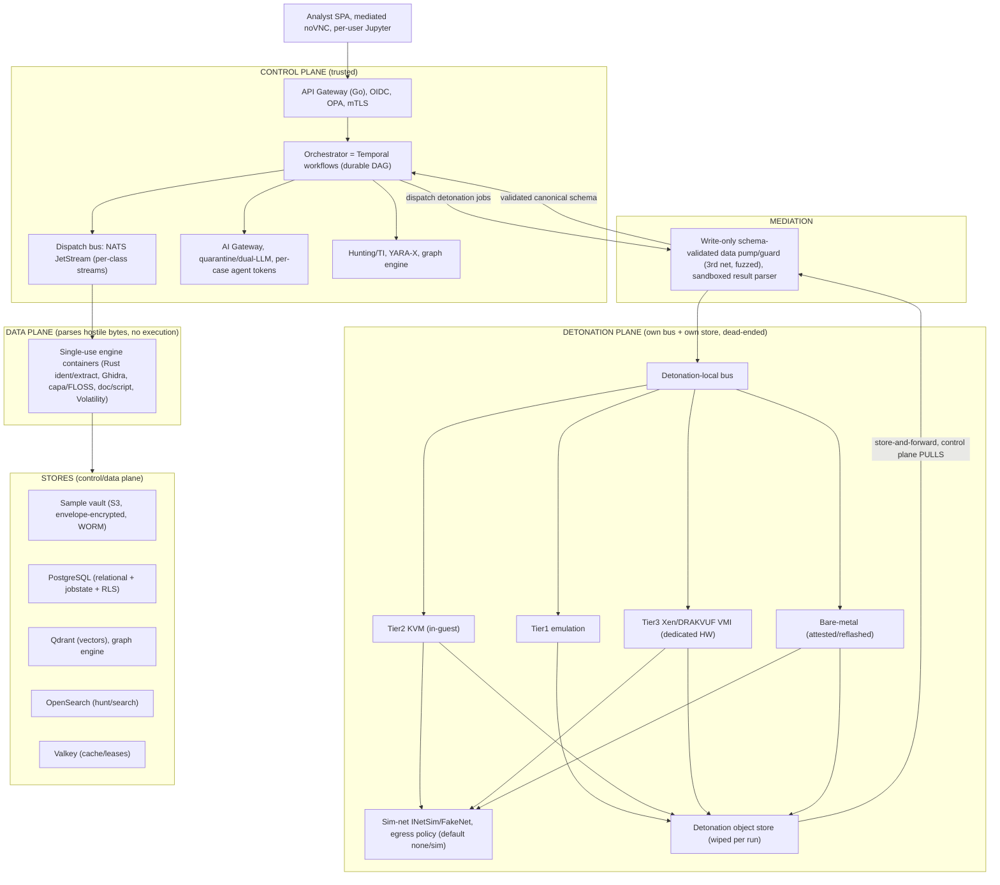

# MalAnalyzer - Architecture & Tech-Stack Design (v1, post-audit)

> Companion to `docs/FEATURE-SPEC.md`. Every significant decision is an **ADR** (*Context -> Options -> Decision -> Why -> Consequences/Feasibility*). This is **v1**, hardened after a four-lens adversarial audit (security/containment, distributed-systems/scale, tech-stack/feasibility/licensing, AI-architecture). ADRs changed by the audit are marked **revised** with a pointer to the reconciliation in **section 8**, which is the full audit trail (finding -> disposition -> change).

**Headline verdict after audit:** the architecture is sound and the "orchestrate the field, don't reinvent it" instinct is right - but (1) the containment controls the "most secure" claim rested on were theater as first drafted and are re-architected here; (2) the AI injection defense was the known-failing prompt-level playbook and is replaced with an architectural (quarantine) control; (3) the licensing model was half-right and is corrected - process separation is *mandatory*, not merely preferred; and (4) the roadmap was ~2-4x under-scoped and is recut. Buildable and legally shippable **over years, not quarters, with counsel sign-off and a detonation specialist hired first.**

> **Round-2 audit (`docs/DESIGN-AUDIT.md`).** A second independent adversarial audit - run before committing the canonical diagram set (`docs/diagrams/`) - attacked v1 and found gaps the four-lens round missed: the dead-end is a **topology** property (absent at single-node), the pump guarantees **parse-safety not honesty** (a compromised detonation host can forge a benign result), the **VM management/lifecycle plane** was an unexamined second control<->detonation channel, and two internal contradictions (worker->store edges; gRPC vs. copyleft). Round-2 amends **ADR-003/004/005/006/007/010/016/017/019/020**; where this document and `DESIGN-AUDIT.md` differ on those points, **`DESIGN-AUDIT.md` wins.** The diagrams depict the corrected design.
>
> **Round-3 review (`docs/ARCHITECTURE-REVIEW.md`).** An 8-lens end-to-end review then attacked the *Round-2* result and found 7 critical + ~15 high issues Rounds 1-2 missed - including regressions from Round-2's own fixes (the worker->broker hostile-parse **RC-2**, the Valkey-alone detonation control loop **RC-4**, the job-ingress contradiction **RC-3**, the circular Tier-2 out-of-band trust **RH-2**) and whole standpoints never audited before (data-lifecycle/erasure **RC-5**, dedup side-channel **RC-6**, operability **RH-6/7**, patent/FTO **RH-12**, governance **RH-13**). A verdict-lattice ordering bug (**RC-1**) and audit-log tamper-evidence (**RC-7**) are fixed in-place; the rest are dispositioned there. **`ARCHITECTURE-REVIEW.md` section 6/section 7 are authoritative for Round-3 changes and open decisions.**

---

## 1. Architectural Overview

Three strongly-isolated **planes**:

- **Control plane** (trusted) - API, auth, orchestration, cases, hunting/TI, detection-eng, AI gateway. Never executes malware.
- **Data plane** - analysis engines that *parse hostile bytes but never execute them*. Sandboxed, memory-capped, network-dead.
- **Detonation plane** (assume-breach) - where malware runs. **Physically segregated, its own bus and object store, no route to and no credentials for the control plane.** Results leave only via a write-only, schema-validated **data pump** the control plane *pulls* from - never a live inbound connection.

> **Canonical rendered diagram set: [`docs/diagrams/`](diagrams/README.md)** - 11 audited Graphviz diagrams (source + SVG/PNG, air-gap-reproducible) covering the trust planes, the detonation dead-end + management plane, the result pump, fail-closed aggregation, the AI quarantine, per-topology deployment, licensing isolation, and the Phase-1 build. The Mermaid blocks in these docs are quick inline sketches; the `diagrams/` set is the reviewable reference.

**Core idea unchanged:** MalAnalyzer's novel value is *unification + multi-tier anti-evasion detonation + a safe local AI layer + an explainable verdict fabric + analyst UX* - not reimplementing Ghidra/Volatility/YARA-X/capa/CAPE-class engines.

---

## 2. Quality Attributes (priority order)
1. **Security & containment** (malware doesn't escape; platform doesn't leak; analyst isn't attacked; AI isn't hijacked) - **wins all conflicts.**
2. **Air-gap operability.** 3. **Explainability.** 4. **Extensibility.** 5. **Scalability (with honest tier-specific limits).** 6. **Analyst UX.** 7. **Maintainability & license integrity.**

---

## 3. Decision Records

### ADR-001 - Modular services on an event-driven pipeline (not a monolith, not microservice sprawl)
Coarse control-plane services + a fleet of **single-use** analysis workers + a segregated detonation subsystem. Precedent: Assemblyline (~21.6M files/day at CCCS), Karton. **KEEP.**

### ADR-002 - Durable orchestration via **Temporal**; NATS JetStream for high-throughput dispatch; Valkey for leases/cache *(revised - section 8 C-ORCH, C-IDEMPOTENCY)*
- **Decision:** **Temporal** (Apache-2.0, runs air-gapped, dev-server single binary) owns durable job/DAG state, retries, per-node timeouts, child workflows, and crash recovery. **NATS JetStream** remains the high-throughput dispatch/event bus for stateless engine fan-out, with **physically separate streams + consumer groups per class** (triage / static / detonation), each with its own `AckWait` and `MaxAckPending`. **Valkey** holds run leases and cache; **authoritative run-state lives in Temporal/Postgres**, never Valkey alone.
- **Why changed:** the original "we'll get durable-workflow semantics cheaper than Temporal in a bespoke orchestrator" hand-waved leader election, idempotent recovery, and - critically - collided with at-least-once redelivery to produce *duplicate detonations*. Temporal's determinism/replay model solves redelivery double-processing directly. The air-gap concern (heavy dep) is real but Temporal runs fully offline.
- **Idempotency:** static engines key on `(content-hash, engine-version)`. Detonation is **non-deterministic**, so it uses a **lease/slot token** (`run_id` keyed by `(hash, engine, submission)`); a redelivered message that finds a live lease **no-ops and awaits the existing run's result**. `AckWait` > max per-tier wall-clock + periodic working-acks so long detonations never redeliver.

### ADR-003 - Recursive DAG as Temporal child-workflows; **fail-closed** caps; formally-specified aggregation *(revised - section 8 C-EVASION-CAPS, C-AGG)*
- **Decision:** each submission is a root workflow; extraction spawns child workflows (recursive). Hard limits (depth, children/node, total nodes, wall-clock/CPU/mem/output budgets, total-decompressed-size) enforced via an **atomic Valkey counter** checked before dispatch, with fan-out sharded so the counter isn't a serialization point.
- **Fail-closed (non-negotiable):** a truncated/over-budget branch is floored at **`suspicious/unknown`, never benign**, and stamps the submission **`analysis_incomplete: potential_evasion`**; blowing a cap **raises** the score. (The v0 design let an attacker blow the cap on the *malicious* child to get it truncated and the verdict finalized clean - the DoS guard was an evasion primitive.)
- **Aggregation (formally specified):** the dedup'd job graph is a **DAG, not a tree**. Verdict rollup is a **monotone `max` over *unique* nodes** (malicious child => malicious parent, no dilution by padding), with a **separate additive diversity/volume signal** (so 50 distinct droppers != 1). Diamond/duplicate cases documented with worked examples. Completion tracked by an **idempotent set of completed child IDs** + a **timeout reaper** that finalizes-as-incomplete.

### ADR-004 - Language strategy, reframed: **the sandbox is the safety control, not the language** *(revised - section 8 H-RUST-BOUNDARY, M-POLYGLOT)*
- **Decision:** **Rust** for our *own* parser code at the hostile boundary (identification, extractor, sanitizers) as **defense-in-depth** - *not* as the safety guarantee. **Python** for all analysis-engine integration and ML/AI glue. **Go** for the control plane (gateway, connectors, egress controller). **TypeScript/React** frontend. **Node stays out of the core** - box-js runs in its own container (a packaging concern, per ADR-005), not a 5th core toolchain. Internal contract: gRPC/protobuf; documented HTTP/JSON for community engines.
- **Why changed:** "Rust => memory-safe boundary" was a category error - the dangerous parsers are **C libraries we wrap** (libarchive, 7-Zip, unrar, libmagic; recent RCEs CVE-2024-11477, CVE-2024-20696) whose unsafety we inherit over FFI, and the marquee archive bugs are **path-traversal/zip-slip logic bugs** Rust can't prevent. Safety comes from running *every* parser (Rust or C) unprivileged, seccomp-strict, network-dead, FS-jailed (`O_TMPFILE`), resource-capped, in a namespace that **rejects symlinks, absolute paths, and `..`**. Rust is still worth it for our own first-touch code; it is not a magic wall.

### ADR-005 - Engine SDK: containerized, uniform contract, **single-use per artifact, tenant-partitioned** *(revised - section 8 H-TENANT-WORKER)*
Uniform `analyze(artifact_ref, ctx) -> {findings, children, score, evidence, att&ck}`; stateless; strict cgroup/seccomp; no network by default; read-only access to one artifact. **New:** a worker processes **exactly one artifact then is destroyed** (no cross-job reuse), and **worker pools are partitioned per tenant** - a worker compromised by tenant A's sample never later touches tenant B's. The same sandbox model wraps the **extractor and the detonation-result parser** (ADR-007), not just plugins.

### ADR-006 - Detonation: multi-tier concept KEPT; containment and scaling **re-architected**; iOS cut, macOS boxed *(revised - section 8 C-HYPERVISOR, C-DOS-ROUTER, H-IOS-MACOS)*
- **Tiers (concept unchanged):** T1 emulation (Speakeasy/Qiling) -> T2 in-guest KVM -> T3 agentless **Xen/DRAKVUF VMI** -> bare-metal. Evasion-routed escalation. CAPE-style YARA hardware-breakpoint debugger for anti-evasion (see licensing note below).
- **Containment (changed):** the detonation plane is a **physically separate cluster on its own management network with *no route* to control-plane infra**, holding **no control-plane credentials**, with its **own bus and own object store wiped between runs**. Nested virtualization is **not** a containment mechanism (it *adds* attack surface; CVE-2026-53359 is a live guest->host escape on "x86 with nested virt" - our exact v0 laptop/cluster config). Prefer **dedicated, non-nested hardware**; **measured/attested boot**; treat bare-metal hosts as **firmware-burned** (full reflash or permanently untrusted - PXE re-image does not evict UEFI/BMC implants).
- **Scaling (changed):** detonation capacity is **physical, not pod-scalable**. **Slot-based admission control** (per-pool semaphore bounded to real slot count); **per-submission/tenant escalation budgets** (T3/bare-metal escalation costs a token); autoscale on **free physical slots**, not queue depth (queue depth -> alerting only); cap per-submission escalations. (The v0 evasion router let a trivial `cpuid`/RDTSC check force every sample T2->T3->bare-metal - a 3x cost amplifier on the scarcest pools.)
- **Platform honesty (changed):** **iOS *detonation* is cut** - there is no lawful OSS iOS-virtualization stack (Apple DMCA section 1201 / the Corellium fight); we offer **static + Frida on bring-your-own jailbroken devices, best-effort**. **macOS** detonation is an **optional BYO-Apple-hardware, self-host-only pool** (macOS SLA: Apple hardware only, <=2 VMs/Mac, no service-bureau) - a hosted commercial macOS-detonation service is **not offerable** under the SLA.
- **CAPE-debugger licensing:** "adapt CAPE" is resolved to **clean-room the technique (ideas-only, Apache)**; if code is reused, it ships as a **GPLv3-licensed isolated worker** (ADR-019 inventory).
- **[!] Residual risk:** Xen/DRAKVUF Tier-3 remains the #1 program risk and is **Phase-2+**, on dedicated hardware, out-of-band from K8s.

### ADR-007 - Containment boundary: a **write-only data pump** (not a "diode"), network-layer air-gap, gated egress *(revised - section 8 C-DIODE, H-EGRESS)*
- **Decision:** results cross from detonation to control via **store-and-forward the control plane *pulls*** (detonation writes to its local spool/store; no inbound live connection; no callable surface either way), fronted by a **separate, minimal, continuously-fuzzed validator/guard on a third network** that neither side trusts. **All** detonation output (PCAP, memory dumps, "config" JSON, decompiler output) is parsed in an **unprivileged, seccomp-strict, network-dead, resource-capped sandbox - never in the orchestrator process** - accepting **canonical schema only**, no complex-object deserialization (no pickle, no protobuf `Any`, hard size/entry caps).
- **Naming:** we stop calling it a "data diode." It is a **write-only, schema-validated data pump/guard** - defense-in-depth. A genuine **hardware data diode** is documented as an **option for highest-assurance deployments**, since a software pump is bidirectional at the transport layer.
- **Egress:** modes `none` (air-gap) -> `simulated` (INetSim/FakeNet, default) -> `filtered-real`. **Air-gap is enforced at the network layer (no route exists), not a software toggle.** `simulated` asserts **no route** and blocks IPv6/link-local and DNS to real resolvers (DNS is an exfil channel). `filtered-real` is **default-off, per-run, two-person-authorized, on physically separate egress infra** (never NAT through anything shared). **Autonomous kill-chain walking** (fetching attacker URLs/redirects) is SSRF/beaconing risk - **off by default, gated behind egress policy.** TLS visibility via DRAKVUF key-extraction (T3) and per-deployment, per-run, **non-exportable** MITM CA (T2). The **cloud-AI path is gated identically to egress** (it *is* egress of possibly-attacker-chosen data). The pump is a partitioned, horizontally-scalable ingest with its own HA.

### ADR-008 - Stores: Postgres for relational/jobstate/RLS; **Qdrant + a graph engine as default at scale**; corrected license rationale *(revised - section 8 H-PG-SPRAWL, H-LICENSE-STALE)*
- **Decision:** **PostgreSQL** for relational data, job/case state, and RLS - its strengths. **Qdrant** (Apache-2.0) for vectors and a **dedicated graph engine (JanusGraph Apache-2.0, or Neo4j-CE GPLv3 isolated)** are the **default at Team/Enterprise tiers**, not deferred escape hatches. **Solo/laptop** may use `pgvector`+`AGE` for simplicity. The **orchestrator's Postgres is isolated from analytical Postgres** so a retrohunt/HNSW build can't evict the pipeline's working set. **OpenSearch** for hunt/search; **SeaweedFS** (S3) with the **filer backed by a replicated metadata store and a minimum replication factor enforced**; **Valkey** for cache/leases.
- **Why changed:** Postgres-as-everything is a mixed-workload SPOF and a scaling false economy - **Apache AGE** is a Cypher->SQL compiler with no graph-native traversal (and open MERGE/label-cache correctness bugs) unfit for deep TI pivots; **pgvector** past ~100M-1B vectors "is no longer the simplest or most cost-effective design," and function-level MinHash over a family corpus is a billions-of-functions workload. The attribution graph and similarity are *headline features*, so pay the integration cost once up front rather than a live migration later.
- **License rationale corrected:** we avoid Elasticsearch/Redis because their **open** option is now **AGPLv3** (unsuitable for a permissive air-gapped core) and their non-AGPL option is non-OSI SSPL/RSALv2 - **not** because they are "closed" (both re-added AGPL, 2024/2025). The **choices stand; the reasoning is fixed.** (Avoiding MinIO is vindicated - its community edition was gutted through 2025.)

### ADR-009 - Sample vault: **envelope encryption**, WORM everywhere, and a real DR story *(revised - section 8 C-KEYLOSS)*
- **Decision:** content-addressed (SHA-256); **envelope encryption** - a per-sample **DEK** wrapped by a per-tenant **KEK** - so KEK rotation re-wraps *DEKs only* (cheap, WORM-compatible), never re-encrypting multi-TB of sample bytes. WORM immutability applies to the sample vault **and to detonation-written artifacts** (no corpus tampering by a compromised detonation host). Hostile content is defanged (`hxxp`, `[.]`) and rendered inert on all egress/UI; downloads are single-sample, encrypted, filename-encrypted archives.
- **DR (new):** documented **Shamir-share escrow** with geographically separated custodians and a **tested restore drill**; OpenBao on replicated storage with its own backup cadence and **HSM auto-unseal**; explicit **RPO/RTO**; vault + OpenBao + Postgres + OpenSearch treated as **one consistency-grouped backup set** with a single air-gap restore runbook rehearsed periodically. (v0 had *no* key-backup/DR story - one key-management incident meant total, permanent corpus loss.)

### ADR-010 - AI layer: **architectural quarantine (dual-LLM/CaMeL)**, per-case scoped agent, entailment-verified grounding, constrained local models *(revised - section 8 C-INJECTION, C-TRIFECTA, C-GROUNDING, H-LOCAL-MODEL, H-CLOUD-SANITIZE, H-CASCADE)*
- **Injection defense (re-architected):** replace prompt-level "data-not-instructions delimiting" (which the major AI labs jointly showed fails >90% and which adaptive attacks break on demand) with an **architectural control**: a **dual-LLM / CaMeL-style quarantine** - the **privileged planner/tool-calling model never sees raw sample-derived tokens**; a **quarantined model with *no* tool access** reads hostile content and returns only **schema-constrained** extractions. This caps a fully-injected model's blast radius even though no defense is complete (CaMeL itself neutralizes ~67% on AgentDojo - we ship the partial-but-real control, not the full-but-fake one).
- **Break the lethal trifecta (re-architected):** the agent's **MCP token is scoped to a single case/artifact**, holds a capability set **strictly smaller than a human's**, and **excludes cross-case, cross-tenant, and global retrohunt/query tools** (those are human-initiated only). **External comms/egress are removed from any context that has touched sample bytes.** Cloud escalation is a **human, out-of-band action no content can trigger.** (v0's "MCP mirrors the full API" assembled attacker-controlled-input + broad private data + an exfil channel - verbatim the GitHub-MCP exploit.)
- **Grounding (strengthened):** "must cite evidence" proves provenance, not correctness - so a deterministic **entailment verifier** confirms the cited finding actually *entails* the claim; "uncited" **and** "cited-but-unsupported" are both rejected, and evidence renders **inline/expandable** beside every AI sentence. The LLM output is **never a field in the scored verdict record** - deterministic engines alone produce the verdict.
- **Local models (constrained):** open-weight code models are fine as **narrow, verified extractors** and **dangerous as free-form RE reasoners** (frontier GPT-4 already errs ~26% on binary-RE; a quantized 7-32B local default is worse; obfuscated Ghidra pseudo-C is their worst-case input). **Forbidden as authoritative:** free-form behavior/family/C2 conclusions feeding the verdict. **Solo tier default = extraction only, no AI RE reasoning.** We publish **per-model, per-task accuracy on a hostile-sample eval set.** Poisoned identifiers can survive LLM "deobfuscation," so the LLM **labels**, it never **rewrites** native code or launders identifiers as clean.
- **Cloud path (honest):** "sanitize a binary" is largely an illusion - the hostile bytes *are* the payload. Default cloud upload is **structural derivatives only** (hashes, imphash/TLSH, capa/ATT&CK tags, IAT, section entropy, YARA hits). Sending raw artifacts is an **explicit, logged "accepted exfiltration of this sample,"** gated by the sample's **data classification + two-person auth**, not a consent click - and impossible in air-gap mode.
- **CASCADE scoped:** the LLM-finds-structure + deterministic-IR-rewrite pattern is **correct for JS/script/VBA deobfuscation** (JSIR is JS-specific); **native RE** gets soundness from emulation (Speakeasy/Qiling), symbolic execution (angr), and CAPE-style dynamic unpacking, with AI **labeling** on top.
- **Runtimes/weights:** vLLM (server) / Ollama (edge), model-agnostic. **Model weights and the inference stack are treated as untrusted-until-verified** - provenance-pinned, signed, scanned; the inference process is sandboxed like any hostile-input parser; model swap is a privileged, audited action.
- **RAG scope:** retrieval is scoped to **the artifact under review**, not the whole case (cross-artifact injection). **AI output is routed back through the ADR-015 inert-render/defang pipeline** (it is now attacker-influenced content); auto-rendered links/images in AI output are forbidden.
- **Action gating:** gate on **confidentiality/data-flow boundaries** (does this move data across a case/tenant/egress line?), not just reversibility; agent drafts are rate-limited and batch-reviewed.

### ADR-011 - Static/RE: crash-isolated Ghidra, **BSim+WARP** identity server (drop FLIRT/Lumina claim), sharded CRDT *(revised - section 8 M-GHIDRA, M-IDENTITY, LM-CRDT)*
- **Ghidra** headless: **one JVM per job with a per-job heap cap and hard wall-clock kill** (crash-isolated - hostile input can hang/OOM/exploit a loader, e.g. the MachoLoader advisory); **cache decompiler output/BinExport2** keyed by content hash, not just the project; **one-shot `analyzeHeadless` for batch**, PyGhidra reserved for interactive/MCP; budget 4-8 GB per warm worker; treat as a scarce **queued** pool, not per-request spawn.
- **Function-identity server:** built on **BSim** (Ghidra, Apache-2.0, Postgres-backed) **+ WARP** (open GUID format) only - plus the MCRIT/MinHash path. **FLIRT and Lumina are dropped from the "unified self-hosted" claim** (FLIRT sig sets are Hex-Rays' non-redistributable IP; Lumina is a proprietary IDA-tied service); at most we *apply* user-supplied FLIRT sigs.
- **Collaborative markup:** CRDT (Yjs/Automerge) is **Phase-2**, **sharded per-function** (a whole binary is too large for one CRDT doc), with a **lightweight ownership/review model** because CRDTs guarantee *convergence, not semantic correctness*. All sample-derived text **including shared markup** passes through the inert/defang layer.
- capa/FLOSS as services; BinExport2/WARP as open interchange.

### ADR-012 - Hunting & TI: local YARA-X retro/live-hunt, offline MCRIT-style attribution, opt-in sharing
YARA-X (BSD-3) retrohunt/livehunt over the corpus with a **signed, immutable, provenance-tracked** bundled goodware corpus for FP-testing; MCRIT-style function-MinHash attribution in Qdrant + the graph engine (ADR-008); MISP/STIX/TAXII connectors isolated and egress-gated; scheduled IOC decay. **KEEP** (graph/vector backing per revised ADR-008; corpus integrity per ADR-013).

### ADR-013 - Detection engineering: fail-closed, signed corpora, human-in-the-loop rule deploy *(revised - section 8 H-CORPUS-POISON)*
Git-backed rules (Gitea, MIT); CI harness (syntax -> FP-vs-goodware -> hit-vs-known-bad -> ATT&CK coverage -> gate). **New guards:** goodware/family corpora are **signed, provenance-tracked, immutable, and never auto-updated from ingested samples** (a poisoned goodware corpus blinds every rule for a family); contributions are gated and reviewed; **LLM-drafted rules must pass deterministic FP/hit tests *and* human review** before deploy; the ML pre-verdict is **explicitly non-authoritative and never auto-clean.**

### ADR-014 - API & integration: **MCP is a scoped subset, not a UI mirror**; hardened auth *(revised - section 8 C-TRIFECTA, M-AUTH)*
Go gateway; REST (OpenAPI) + GraphQL for the TI graph. OIDC (Keycloak, Apache-2.0; embedded lighter OIDC for single-node). **The "UI-parity for MCP" rule is deleted:** the **agent's MCP surface is a deliberately smaller, capability-scoped, per-case subset** - an agent steered by sample bytes must have **less** power than an authenticated human, never equal. Authz: **OPA default-deny with policy unit tests in CI**, no `alg=none`, strict redirect/audience validation, short-lived tokens, **mTLS between planes.** Cortex-style enrichment/responder bus for SOAR; egress-/action-gated per ADR-007/010.

### ADR-015 - Frontend/UX: mediated interactive channel, per-user kernels, hostile-content-safe everywhere *(revised - section 8 M-ANALYST-SURFACE)*
React+TS SPA; role-based surfaces. **Interactive detonation control channel is routed through mediation, not a direct WebSocket to the detonation host**; clipboard/file **bridges are disabled with no per-session re-enable in multi-tenant mode.** **Server-side Jupyter kernels are per-user, unprivileged, network-dead, scoped-token; no raw-notebook sharing without sanitization** (a shared notebook is arbitrary code execution and an analyst-to-analyst vector). **All** sample-derived text (decompiler output, FLOSS strings, CRDT markup, **and AI output**) passes through a shared **inert-render/defang** layer (sanitize, no live links, strict CSP, sandboxed iframes) - treating XSS/homoglyph/RTL-override as expected.

### ADR-016 - Trust boundaries, tenancy, assume-breach - **architected, not asserted** *(revised - section 8 C-HYPERVISOR, H-TENANT)*
- Detonation is **dead-ended** (no route, no creds - see ADR-006/007); the post-escape host **can reach nothing**, which is what makes "assume-breach" real.
- **Multi-tenancy:** **hard isolation is the default for cross-organization tenancy** (separate schemas/instances, per-tenant keys, tenant-partitioned worker pools) - for a live-malware vault, cross-tenant leakage is catastrophic, and RLS alone is one `SECURITY DEFINER`/owner-connection/policy-typo away from a breach. Where RLS is used, it runs via a **non-owner role + app-layer tenant scoping + query allowlists** as defense-in-depth. Workers are **single-use and never reused across tenants** (ADR-005).
- **Secrets:** OpenBao (MPL-2.0). **Everything auditable** (submissions, runs, verdict overrides, cloud-AI calls, exports) in a **tamper-evident** log - *(R3 RC-7)* hash-chained (each entry commits `H(prev)`), written via an INSERT-only non-owner role (`UPDATE`/`DELETE` revoked), with periodic signed checkpoints mirrored to the WORM store as an independent copy, so a privileged insider cannot silently rewrite history. "Immutable-by-comment" is not a mechanism.
- **Two-person authorization (R3 RM-7)** - wherever the design requires it (cloud egress / "accepted exfiltration" ADR-010, `filtered-real` ADR-007, offline signing ADR-020) it means **two *distinct* OIDC subjects in different role-holders, MFA-bound, self-approval rejected, both recorded in the tamper-evident log** - never one human with two accounts. Small tiers that cannot staff two people get a documented single-operator override with heightened audit, not a silently-defeated gate.
- **Insider / rogue-admin actor (R3 RM-8)** - added to the threat model: separation-of-duties + audited change-control across OPA-policy deploys, OpenBao root/unseal, and audit-log storage admin (no single identity holds all three); OpenBao Shamir threshold >=2 with a duress posture; master-key reconstruction and any raw-corpus bulk read produce an audited, notarized event.

### ADR-017 - Deployment: "same images, **three deliberately different topologies**"; detonation is tier-specific *(revised - section 8 H-SAME-IMAGES)*
- **Decision:** byte-identical OCI **images**, but **explicitly different reference topologies and honest per-tier limits** - the detonation plane and stateful stores are **not the same system** at each tier:
  - **Solo/laptop:** `docker-compose`/Podman. **Tier-1 emulation only** (Docker Desktop on macOS/Windows has **no `/dev/kvm`**), with **optional remote detonation** to a shared pool. Ollama, **extraction-only AI**.
  - **Team/small air-gap:** K3s; a few nodes + GPU; Tier-2 KVM on a bare-metal node; optional one Xen node; Qdrant + graph engine.
  - **Enterprise:** K8s + Helm for the stateless planes; **detonation runs on bare-metal node pools managed by a dedicated out-of-K8s controller** (Xen/DRAKVUF and bare-metal cannot be nested/containerized as K8s pods; KubeVirt needs bare-metal and struggles with nested Windows).
- **Offline bundle:** signed tarball of images + **provenance-pinned model weights** + YARA/family/goodware corpora + signature DBs, installed into an air-gapped registry; sneakernet updates with signature/attestation verification.
- **Published minimums** (RAM/GPU per tier, detonation + AI enabled) ship with the docs - no more implying a 16 GB laptop runs the full stack.

### ADR-018 - Observability: Prometheus/Grafana/OTel/Loki, offline; note AGPL *(revised - section 8 minor)*
Prometheus (metrics) + Grafana (**AGPLv3**) + OpenTelemetry + **Loki (also AGPLv3)** - the AGPL components run **unmodified as separate services** (ADR-019). Queue-depth/backpressure/pool-health dashboards are first-class, but **queue depth is an alerting signal, never the detonation autoscaling signal** (which is free physical slots, ADR-006). No external telemetry, ever.

### ADR-019 - Licensing: Apache-2.0 **core**, each copyleft engine its **own** component; process separation **mandatory**; per-component CI gate; **counsel required** *(revised - section 8 C-LICENSE, H-VOLATILITY)*
- **Corrected framing:** the FSF test for "separate vs combined work" turns on **both** communication mechanism **and** semantics - pipes/sockets/CLI/normalized-schema RPC suggest separateness; **in-process `import`/linking and exchanging complex internal structures create a combined (derivative) work regardless of containerization.** Several engines are **in-process libraries**: Qiling `import`s **Unicorn (GPLv2)**; Speakeasy (MIT) **loads Unicorn (GPLv2) in-process**; the memory worker `import`s **Volatility 3 (VSL copyleft)** and **MemProcFS (AGPLv3)**. Putting them in a container does **not** make them aggregation.
- **Decision:** the **Apache-2.0 core** is protected by a true IPC/normalized-schema boundary (ADR-005's contract *strengthens* the aggregation argument). **Each copyleft engine is its own separately-licensed component** that **inherits its library's license** (GPLv2 / GPLv3 / AGPLv3 / VSL), ships that license + a source offer, and - because **Apache-2.0 is incompatible with GPLv2** (patent clause) - **process separation is mandatory, and copyleft workers may not import shared Apache-licensed helper libs.** The **CI license-gate is per-component with transitive dependency resolution** (it must catch Speakeasy->Unicorn) and **fails the build** on a disallowed license entering the core. *(R3 RH-8/RM-27):* the gate encodes a **pairwise compatibility matrix**, not a copyleft/permissive boolean - Apache-2.0 is incompatible only with **GPLv2/LGPLv2.1** (block), and **compatible** with GPLv3/AGPLv3/LGPLv3 (allow); VSL/bespoke -> manual review. It also scans the **ELF/import graph and runtime linkage** (not just SBOM manifests) to catch in-process `ctypes`/`dlopen` of a GPL `.so`, enforces a **plugin license contract** (the loader refuses to co-load a GPL/AGPL plugin into the Apache core process), and covers **model weights and content corpora** (invisible to SBOM). The blessed inventory must be **complete across all phases** before counsel review (it currently omits e.g. libemu/scdbg-GPLv2 in the Phase-1 P0 shellcode feature, MobSF-GPLv3, and angr->Unicorn-GPLv2).
- **Corrections:** **Volatility 3 is VSL (bespoke copyleft), *not* "BSD-like"** - its share-alike clause explicitly captures "a wrapper," i.e. our worker; isolate it, publish source, add VSL to the gate. **radare2 core is LGPLv3** (link-safe - removed from the copyleft-risk list). **AGPL section 13 trap:** MISP, the MemProcFS worker, Grafana, and Loki ship **unmodified** (config-only) - patch-and-serve triggers a source obligation to network users; the CI gate enforces "no source patches" for AGPL components.
- **[!] Requires counsel sign-off** on the in-process-import boundary (legally unsettled - adopt the conservative reading). This is the single most-important non-technical decision; getting it wrong silently relicenses the core.

### ADR-020 - Supply chain: attestations + witnessed offline signing; reproducible builds; model-weight provenance *(revised - section 8 M-SUPPLYCHAIN)*
Bare offline cosign with local keys drops the accountability a transparency log provides, so: **in-toto attestations + threshold/witness co-signing** (no single key can forge; a second party verifies provenance air-gapped), **reproducible builds made real** (independent rebuild-and-diff, not "where feasible"), **SBOM** (Syft/CycloneDX), pinned+vetted deps. **Model weights get provenance + scanning + a pinned recommended set**; loading arbitrary weights is a privileged, audited action. We are a security tool - a compromised update is catastrophic.

---

> **ADR-021 -> ADR-024 are the four M0 "pins"** (from `ARCHITECTURE-REVIEW.md` section 7): decisions that shape the M0 schema and are **cheap now, a rewrite later**. They must be ratified before M0 touches the data layer. Each states its recommended decision and what it unblocks. *Philosophy: do it right, not fat - one trust domain in Phase-1, but the schema is correct for many.*

### ADR-021 - Trust domains, per-domain dedup, and the key hierarchy *(M0 pin - closes RC-6)*
- **Context.** Global content-hash dedup leaks cross-tenant sample **existence + timing** and is incompatible with per-tenant KEKs + hard isolation; "Phase-2 is a migration, not a rewrite" is **false** while `samples` is keyed on `sha256` alone.
- **Decision (recommended).** The isolation unit is a **trust domain**. **Content-addressing and dedup are scoped per domain** - identical bytes in two domains are stored and DEK-wrapped **twice**, once per domain. **Phase-1 runs exactly one domain** (single-org), so operations stay simple, but the schema is multi-domain-correct from day one.
- **Schema (M0).** Every sample/case/submission/job/finding/evidence/verdict/detonation_run row carries `domain_id` from day one; **`samples` PK = `(domain_id, sha256)`**, never `sha256` alone. `first_seen` and dedup-hit latency are per-domain and **never observable across domains**.
- **Cross-domain intelligence** (retrohunt/attribution - the headline value) is a **separate, opt-in, derivative-only sharing layer**: only structural derivatives (hashes, TLSH/imphash, capa/ATT&CK tags, MinHash features) cross a domain boundary, **never raw-sample existence**, and only for domains that opt in. A governed channel, not an accident of shared storage.
- **Consequences / Unblocks.** Closes the existence side-channel; makes per-domain keys coherent; makes Phase-2 multi-domain an *additive* migration. Cost: the corpus is federated, so cross-domain hunting goes through the opt-in derivative layer (a feature, not a leak). **Unblocks the M0 vault + DB schema.**

### ADR-022 - DEK custody: wrapped DEKs in OpenBao, bounded key-backup retention, split custody *(M0 pin - closes RM-1, enables RC-5 erasure)*
- **Context.** A wrapped DEK in a WORM row can be neither rotated nor destroyed -> KEK rotation and crypto-shred are both impossible, and DR co-locates ciphertext with keys.
- **Decision (recommended).** The **wrapped DEK lives only in OpenBao's mutable, versioned key catalog**, keyed `(domain_id, sha256)`; the WORM `samples` row holds storage-key + metadata only. **KEK rotation = re-wrap in OpenBao** (never touches the WORM vault). **Crypto-shred = destroy the DEK and all its copies.**
- **Erasure lever.** Key-catalog backups carry a **bounded retention** (unlike the indefinite WORM vault), so destroying a DEK propagates through backups within the retention window and the WORM ciphertext becomes permanently unrecoverable **without violating WORM** - the mechanism that makes RC-5 lawful erasure achievable.
- **DR.** The **key backup is separately custodied from the ciphertext backup** (different media/custody) so no single stolen or seized backup set yields both.
- **Consequences / Unblocks.** Rotation is cheap; lawful crypto-erasure is achievable - *pending counsel confirming it satisfies each regulator (a ship-gate, not a start-gate)*. **Unblocks M0 vault + OpenBao integration.**

### ADR-023 - Tamper-evident audit + erasure-capable derived stores *(M0 pin - closes RC-7, enables RC-5)*
- **Context.** Audit immutability was a SQL comment; personal data lives in cleartext across derived stores with no deletion path.
- **Decision - audit.** `audit_log(..., prev_hash, entry_hash)` with `entry_hash = H(prev_hash || canonical(row))`; written via an **INSERT-only non-owner role** (UPDATE/DELETE revoked at the DB); **periodic signed checkpoints mirrored to the WORM object store** as an independent copy so tampering is detectable air-gapped. **PII-bearing fields stored as references/pseudonyms**, so an erasure removes the referent while the hash-chain still verifies.
- **Decision - derived stores.** findings/evidence/`detonation_runs.canonical_result`, OpenSearch, Qdrant, graph are **rebuildable projections** keyed `(domain_id, sample_sha256)` with a Postgres **watermark**; a per-sample erasure = tombstone + sweep/rebuild across all of them; any verdict/hunt surface checks the watermark and fails-closed/refreshes if stale (also closes the DR-staleness finding RM-5).
- **Consequences / Unblocks.** Chain-of-custody becomes court-defensible; lawful erasure gets a concrete cross-store mechanism; DR restores are consistency-checkable. **Unblocks M0 audit + M1 findings/evidence schema.**

### ADR-024 - Release engineering is a first-class track, de-risked from M0 *(pin - closes RM-20)*
- **Context.** Reproducible builds + SBOM + attestations + witnessed signing + the bidirectional license gate + the invariant->test traceability gate + the offline bundle/revocation were folded into one M4 milestone - a program masquerading as a checkbox.
- **Decision (recommended).** These are **one owned track with a named owner** (a release/supply-chain engineer), running alongside product milestones. A **reproducible-build spike is an M0 acceptance item** (prove Python + container determinism early, not at M4). The **license gate sees runtime/`dlopen`/plugin linkage**, not just SBOM manifests (per the ADR-019 R3 update), and is a standing CI gate.
- **Consequences / Unblocks.** The supply-chain program stops being an end-of-project wall; determinism problems surface while cheap. **Dependency to fill: the owner role.** Does not block M0 code; the spike lands *in* M0.

---

## 4. End-to-End Data Flow
1. **Submit** -> gateway authn/authz -> sample streamed to the **envelope-encrypted WORM vault** (SHA-256 dedup) -> **Temporal root workflow** created.
2. **Identify** (Rust/Magika, sandboxed) -> true type -> routing.
3. **Extract** (Rust, sandboxed, symlink/`..`-rejecting, size/entry-capped) -> children -> child workflows (bounded, **fail-closed** on caps).
4. **Static fan-out** (single-use, tenant-partitioned workers): ML pre-verdict (non-authoritative), PE/format triage, FLOSS, capa (ATT&CK/MBC), doc/script/shellcode/mobile, Ghidra on demand (cached).
5. **Dynamic** (if warranted): **slot-admitted, budget-gated** evasion-routed detonation in the segregated plane (default `none`/`simulated` net); behavior, config, memory, PCAP, TLS keys -> written to the detonation-local store -> **pulled and validated by the data pump** -> parsed in a sandbox -> canonical schema to the orchestrator.
6. **Aggregate** (monotone `max` over unique DAG nodes + diversity signal; truncations => suspicious) -> **explainable, deterministic verdict** (every point traces to finding+engine+ATT&CK).
7. **Enrich & hunt:** offline TI, MCRIT attribution, livehunt, graph update.
8. **AI assist (quarantined, per-case, entailment-verified, labeled, advisory):** extraction + summaries beside evidence; local by default; cloud only as gated egress of structural derivatives.
9. **Present & collaborate:** triage queue, evidence tree, RE view (mediated), pivot canvas, shared annotations (defanged), verdict workflow with override + audit.
10. **Export:** STIX 2.1 / Markdown-PDF / YARA-Sigma pack / MISP event - **defanged**.

---

## 5. Reference Deployment Tiers (honest limits)

| Tier | Deploy | Detonation | Stores | AI | Notes |
|------|--------|------------|--------|-----|-------|
| **Solo** | compose, 32-64 GB | **Tier-1 emulation only** (+ optional remote pool) | PG (+pgvector/AGE), Valkey, PG-FTS | Ollama, **extraction only** | No `/dev/kvm` on Mac/Win laptops |
| **Team / small air-gap** | K3s + >=1 bare-metal + GPU | T1-T2 KVM, optional 1 Xen | PG + Qdrant + graph engine + OpenSearch | vLLM (>=24 GB GPU) | 1 detonation specialist |
| **Enterprise** | K8s (stateless) + out-of-band detonation controller | T1-T3 + bare-metal + BYO-mac pool | HA PG (split OLTP/analytics) + Qdrant + graph + OpenSearch | vLLM fleet (A100/H100) + gated cloud | millions/day: *stateless* half scales; detonation is physically bounded |

**AI hardware honesty:** a mid-size code model (e.g. 32B) is ~71 GB VRAM at FP16, ~18-25 GB at Q4 - a 24 GB card runs one user mediocrely; real multi-analyst serving wants 80 GB-class GPUs. Below that, run **extraction-only**, not RE reasoning.

---

## 6. Feasibility & Build Order (recut after audit)

**The v0 "Phase 1 = all P0" was ~5 products and 6+ senior specialties (18-36 months), violating our own scope-discipline risk.** Recut:

- **Phase 1 (the true wedge, single-node):** ingest -> Magika -> recursive extract (sandboxed) -> static (capa/FLOSS/DIE/YARA-X) -> **Tier-2 KVM detonation only** (INetSim, disposable VM, write-only pump) -> normalized evidence tree + score-driven triage queue -> RBAC/OIDC/audit -> containerized deploy. **Postgres-FTS before OpenSearch.**
- **Phase 1.5:** full Volatility (isolated VSL worker), Ghidra headless service, mediated noVNC interactive view, OpenSearch, per-user Jupyter, quarantined local-AI **extraction**.
- **Phase 2:** Tier-3 Xen/DRAKVUF (dedicated HW), agentless VMI, hunting/retrohunt + goodware corpus, MCRIT attribution + graph engine, case collaboration + sharded CRDT, hybrid guardrailed cloud AI, function-identity (BSim+WARP), detection-eng CI.
- **Phase 3 (frontier):** CASCADE-style JS deobfuscation, generic unpacker, symbolic execution, STIX knowledge graph, NL investigation agent (per-case scoped).

**Hire the detonation specialist first** - it is the long pole and the highest-risk plane. **Engage counsel** on ADR-019 before shipping.

**Top residual risks:** (1) Tier-3 Xen/DRAKVUF ops on customer air-gapped hardware; (2) the in-process-import licensing boundary (needs counsel); (3) local-AI quality vs. GPU cost; (4) integration/maintenance surface of dozens of churning upstreams; (5) scope discipline. **Honest verdict: the architecture earns its ambition; the plan now respects it - buildable and legally shippable over years, not quarters.**

---

## 7. Residual Open Questions
- Counsel's ruling on in-process copyleft imports (ADR-019) - conservative reading assumed until then.
- Hardware data diode vs. software pump for the highest-assurance tier (ADR-007) - offered as an option.
- Apache AGE longevity at the Solo tier vs. standardizing on the graph engine everywhere (ADR-008).
- Whether a bare-metal detonation pool can ever be cost-viable above ~tens of thousands of runs/day (ADR-006) - likely a documented ceiling, not a solved problem.

---

## 8. Audit Findings & Reconciliation

Four independent auditors (security/containment, distributed-systems/scale, tech-stack/feasibility/licensing, AI-architecture) attacked v0. **Convergence was high** - the items below were often raised by two or more lenses independently, which is the strongest signal they are real. Disposition key: **[x] Accepted**, **[~] Partially accepted**, **[no] Rejected (with reason)**. One auditor also **detected and correctly ignored a prompt-injection attempt** in its own context that tried to invert its licensing conclusions - a live instance of this platform's own threat model, and a point in favor of the ADR-010 quarantine posture.

### Critical
- **C-DIODE [x]** *(security, distributed)* - The v0 "logical data diode" was theater: detonation shared the task bus **and** object store with the trusted plane (pre-built pivot), and even a perfect one-way pipe just delivers attacker bytes to a trusted parser. **Change:** ADR-007/016 - detonation gets its own bus + own store, dead-ended (no route/creds); results via pulled store-and-forward through a fuzzed validator; all output parsed in a sandbox, never the orchestrator; renamed "write-only data pump"; hardware diode offered for highest assurance.
- **C-HYPERVISOR [x]** *(security)* - Containment bet on KVM + nested virt, the exact config of a 2026 guest->host escape (CVE-2026-53359); nested virt *adds* attack surface; PXE re-image doesn't evict firmware implants. **Change:** ADR-006/016/017 - physically separate, non-nested, dead-ended detonation hardware; measured/attested boot; bare-metal treated firmware-burned; nested virt explicitly not a containment control.
- **C-INJECTION [x]** *(AI, security)* - The prompt-level "data-not-instructions" defense is the exact stack shown to fail >90%. **Change:** ADR-010 - architectural **dual-LLM/CaMeL quarantine** (planner never sees sample bytes; quarantined no-tool model -> schema).
- **C-TRIFECTA [x]** *(AI, security)* - "MCP mirrors the full API" built the lethal trifecta (attacker input + broad private/cross-tenant data + exfil channel) - verbatim the GitHub-MCP exploit; read-only tools suffice to exfiltrate. **Change:** ADR-014/010 - MCP UI-parity **deleted**; agent token per-case, capability subset of human, cross-tenant/global tools excluded; egress removed from any sample-touching context.
- **C-EVASION-CAPS [x]** *(distributed, security)* - DoS recursion caps were an **evasion primitive**: blow the cap on the malicious branch -> truncated -> verdict finalizes clean. **Change:** ADR-003 - **fail-closed** (truncation => suspicious, never benign; caps *raise* score; `analysis_incomplete: potential_evasion`).
- **C-AGG [x]** *(distributed)* - Score aggregation over a dedup'd **DAG** double-counts (duplicated malicious child) or under-counts (collapsed distinct droppers), and the cap counter races or serializes fan-out. **Change:** ADR-003 - monotone `max` over unique nodes + separate diversity signal; atomic Valkey counter with sharded fan-out; documented diamond cases.
- **C-IDEMPOTENCY [x]** *(distributed)* - At-least-once delivery + non-idempotent detonation => duplicate concurrent VM detonations / self-DoS; last-write-wins over run records. **Change:** ADR-002/006 - Temporal determinism; detonation lease tokens (redelivery no-ops onto the live run); `AckWait` > wall-clock + working-acks; append-only run records + canonical-run pointer.
- **C-DOS-ROUTER [x]** *(distributed)* - A trivial `cpuid`/RDTSC check forces every sample to escalate T2->T3->bare-metal (3x cost on scarcest pools); HPA-on-queue-depth is meaningless against a physical slot ceiling. **Change:** ADR-006/017 - slot-based admission control; per-submission/tenant escalation budgets; autoscale on free physical slots.
- **C-KEYLOSS [x]** *(distributed)* - No key-backup/DR: one OpenBao/key incident = total permanent corpus loss; WORM fights key rotation. **Change:** ADR-009 - envelope encryption (rotate KEK, re-wrap DEKs only); Shamir escrow + tested restore; RPO/RTO; consistency-grouped backup set; HSM auto-unseal.
- **C-LICENSE [x]** *(tech/licensing)* - "Separate-process = aggregation" is only half the FSF test; in-process imports (Qiling/Unicorn/Volatility/MemProcFS, Speakeasy->Unicorn) are combined works regardless of containers; Apache<->GPLv2 incompatibility makes process separation **mandatory**. **Change:** ADR-019 - per-component licensing, each copyleft engine its own component inheriting its license; transitive per-component CI gate; counsel sign-off; conservative reading.
- **C-GROUNDING [x]** *(AI)* - "Must cite evidence" proves provenance, not correctness; poisoned identifiers survive LLM deobfuscation. **Change:** ADR-010 - entailment verifier (reject cited-but-unsupported); inline evidence; LLM never a verdict field; LLM labels, never rewrites native/launders identifiers.

### High
- **H-VOLATILITY [x]** *(licensing)* - Volatility 3 mislabeled "BSD-like"; it's **VSL bespoke copyleft** whose wrapper clause captures our worker. **Change:** ADR-019 - corrected, isolated, source published, VSL added to gate.
- **H-LICENSE-STALE [x]** *(licensing)* - ES (2024) and Redis 8 (2025) re-added AGPLv3; radare2 core is LGPLv3; Loki is AGPLv3 (missed). **Change:** ADR-008/018/019 - rationale rewritten (avoid because AGPL, not "closed"); radare2 de-risked; Loki flagged. Choices stand.
- **H-IOS-MACOS [x]** *(licensing)* - iOS detonation legally unshippable in OSS (DMCA section 1201); macOS confined to Apple hardware, <=2 VMs, no service-bureau. **Change:** ADR-006 + spec - iOS detonation cut to static+Frida BYO; macOS = BYO-Apple self-host only; hosted commercial macOS-detonation ruled out.
- **H-PG-SPRAWL [x]** *(distributed)* - Postgres-as-everything (AGE/pgvector) won't carry the attribution graph / billion-vector similarity; mixed OLTP/OLAP SPOF. **Change:** ADR-008 - Qdrant + graph engine default at scale; orchestrator PG isolated from analytics.
- **H-SAME-IMAGES [x]** *(distributed)* - "Same images = same system" breaks: no `/dev/kvm` on Mac/Win laptops; KubeVirt needs bare-metal; Xen can't be a pod. **Change:** ADR-017 - "same images, three different topologies"; detonation tier-specific; published minimums.
- **H-RUST-BOUNDARY [x]** *(security)* - "Rust = safe boundary" is a category error (wraps C libs; archive bugs are path-traversal). **Change:** ADR-004/005/009 - safety from the sandbox; symlink/`..`-rejecting extraction; Rust as defense-in-depth only.
- **H-TENANT [x]** *(security, distributed)* - RLS-in-shared-DB + cross-tenant worker reuse too soft for a live-malware vault. **Change:** ADR-016/005 - hard isolation default for cross-org; single-use, tenant-partitioned workers.
- **H-EGRESS [x]** *(security)* - `filtered-real`, autonomous kill-chain walking, and cloud-AI are deliberate air-gap holes; `simulated` still leaks via DNS/IPv6. **Change:** ADR-007/010 - network-layer air-gap; two-person per-run `filtered-real` on separate infra; kill-chain walking off by default; DNS/IPv6 blocked in `simulated`; cloud-AI gated as egress.
- **H-CORPUS-POISON [x]** *(security)* - Goodware-corpus poisoning blinds rules; ML pre-verdict evadable/auto-clean. **Change:** ADR-013 - signed/immutable corpora, never auto-updated from ingest; human review of LLM rules; ML non-authoritative.
- **H-LOCAL-MODEL [x]** *(AI)* - Local open-weight models are unreliable RE reasoners (GPT-4 ~26% error). **Change:** ADR-010 - constrained to verified extraction; Solo = extraction-only; publish hostile-eval accuracy.
- **H-CLOUD-SANITIZE [x]** *(AI)* - "Sanitize a binary before cloud" is largely illusory; hard cases (most sensitive) are the ones routed out. **Change:** ADR-010 - structural derivatives only by default; raw send = classified, two-person "accepted exfiltration."
- **H-CASCADE [x]** *(AI)* - CASCADE over-generalized; it's JS/JSIR-specific. **Change:** ADR-010 + spec - scoped to JS/script/VBA; native RE uses deterministic emulation/symbolic + AI labeling.
- **H-SCOPE [x]** *(licensing/feasibility)* - "Phase 1 = all P0" is ~5 products / 6+ specialties / 18-36 months. **Change:** section 6 + spec section 9 - Phase 1 recut to ingest->static->Tier-2-KVM->triage; detonation specialist first; counsel engaged.
- **H-WORKFLOW-ENGINE [~]** *(distributed)* - Bespoke DAG orchestrator under-costs HA/recovery. **Disposition:** adopted **Temporal** (the auditor's preferred option) rather than fully specifying a custom engine - it also fixes C-IDEMPOTENCY; the air-gap-heaviness caveat is accepted and mitigated (Temporal runs offline / dev-server for Solo). ADR-002/003.

### Medium
- **M-GHIDRA [x]** - Ghidra is RAM-bound and crash-exploitable on hostile input. **Change:** ADR-011 - one-JVM-per-job, heap cap + wall-clock kill, cache decompiler output, one-shot for batch.
- **M-IDENTITY [x]** - FLIRT/Lumina aren't self-hostable OSS (proprietary IDA tech). **Change:** ADR-011 - identity server on BSim+WARP only; drop FLIRT/Lumina claim.
- **M-POLYGLOT [~]** - 5 toolchains over-costs a small team. **Disposition:** accepted the trims (Node out of core; Rust scoped tight; Go+Python control/analysis) but kept Rust at the hostile boundary as the one earned polyglot cost. ADR-004.
- **M-ANALYST-SURFACE [x]** - noVNC/Jupyter/CRDT are RCE/XSS surfaces. **Change:** ADR-015 - mediated control channel, per-user network-dead kernels, all sample-derived text (and AI output) through inert-render.
- **M-SUPPLYCHAIN [x]** - Offline cosign without a transparency log + unsigned model weights. **Change:** ADR-020 - in-toto attestations + witnessed signing; model-weight provenance/scanning; reproducible builds made real.
- **M-AUTH [x]** - Gateway/OIDC/OPA is the crown-jewel surface. **Change:** ADR-014 - OPA default-deny + CI policy tests, no `alg=none`, mTLS between planes.
- **M-CAPE-LICENSE [x]** - "Adapt CAPE" (GPLv3) is ambiguous. **Change:** ADR-006 - clean-room (Apache) or isolated GPLv3 worker; decided explicitly.
- **M-AGE-CRASH [x]** - Apache AGE has open correctness/crash bugs. **Change:** ADR-008 - AGE only at Solo; graph engine at scale.

### Low / Watch
- **LM-CRDT [x]** - CRDT convergence != semantic correctness. **Change:** ADR-011 - Phase-2, per-function sharding, ownership/review model.
- **L-CA-KEY [x]** - MITM CA reuse risk -> per-deployment/per-run non-exportable (ADR-007).
- **L-ARTIFACT-WORM [x]** - detonation artifacts need WORM too (ADR-009).
- **L-DEDUP-REPLAY [x]** - replayed result must not double-count (ADR-003 idempotent completion set).
- **L-GPL-PATCH-PATH [x]** - don't let license fear block patching GPL detonation tools (fast-patch path kept in ADR-019/020).
- **L-AGPL-13 [x]** - ship AGPL components unmodified; CI guardrail (ADR-018/019).

### Rejected / not adopted
- **[no] "Mandate a hardware data diode."** Adopted the write-only software pump as default and offer a hardware diode as an **option** - mandating it would price out the Solo/Team tiers that are core adoption. (ADR-007)
- **[no] "Drop Rust entirely to cut the polyglot bill."** Kept Rust at the hostile-input boundary - memory safety for our own first-touch parser code is a justified defense-in-depth cost even though it is not the primary control. (ADR-004)
- **[no] "Standardize on the graph engine everywhere, delete AGE."** Kept `pgvector`/AGE at the **Solo** tier only (operability), graph engine at scale - flagged as a watch-item rather than a hard rule. (ADR-008)

**What the auditors told us to KEEP (survived intact):** the three-plane model; assume-breach posture; the Assemblyline/Karton orchestrator + single-use worker + normalized-contract shape; NATS JetStream + Valkey; content-addressed immutable vault; OSI-license discipline (OpenSearch/Valkey/SeaweedFS/OpenBao/YARA-X/vLLM) and Apache-core + copyleft-as-separate-component strategy; Ghidra (Apache-2.0) as RE core; capa/FLOSS/Magika; the *principle* that AI is advisory/segregated from the deterministic verdict with an air-gap hard toggle; honest [!]RISK flags. The intellectual honesty of v0 (it teed up "is the data diode theater?" as an open question - it was) is the reason the audit could be this productive.
