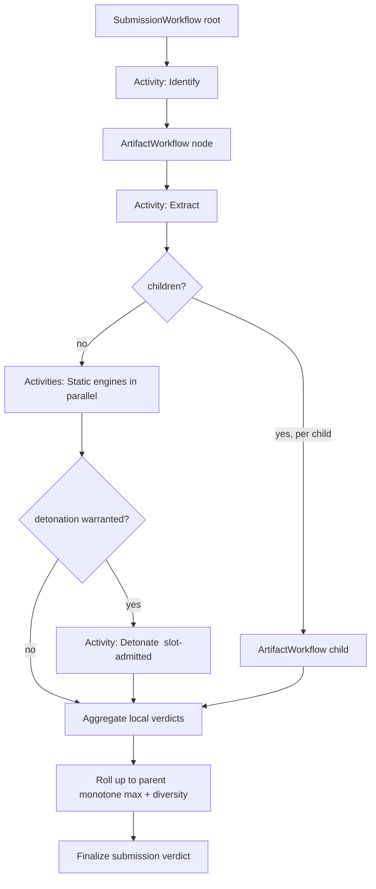

# MalAnalyzer - Phase-1 Component-Level Technical Design

> Turns the hardened architecture (`docs/ARCHITECTURE.md` v1) into a **buildable** Phase-1. Scope is the recut wedge only - deliberately small so it ships correct and safe. Diagrams are Mermaid (render inline on GitHub/editors; `mmdc` renders them to SVG if static images are ever needed).
>
> **Assurance stance:** "no room for mistake/lapse/workaround" is enforced by three things in this doc - (1) every cross-boundary interface has an explicit, validated schema; (2) every failure and every limit is **fail-closed**; (3) section 11 defines an adversarial test corpus that must pass in CI before any release. Perfect security is not claimed; **no *unaddressed* or *silent* path** is the bar, with residuals owned in `docs/THREAT-MODEL.md`.
>
> **Round-2 audit (`docs/DESIGN-AUDIT.md`).** A second adversarial audit corrected this design before the canonical diagrams (`docs/diagrams/`) were drawn: detonation must be a **separate physical node** for escape-containment (all-in-one single-node is dev/eval only, A1); the **VM management plane is detonation-local and dead-ended** (A3); the **pump is two processes** (A4); **workers hold no store credentials** (A5/A6); a detonation self-report is **untrusted** (A2). See invariants #4-#10 (section 7) and `DESIGN-AUDIT.md`.
>
> **Build kickoff (`docs/DECISION-LOG.md`).** Phase-1 is **re-scoped to the static wedge only** - detonation -> Phase-2 (D2), differentiator = **MACO config extraction** (D3), built **hostile-boundary-first** (D4), **minimum stateful set** (D5), pins ratified but compliance mechanisms deferred ("pin != build", D1). **Design is frozen (D0); this doc's section 0/section 10 reflect the re-scope.**

---

## 0. Phase-1 Scope & Non-Goals

**In scope (the static wedge - R3 `DECISION-LOG.md` D2/D3):** submit -> identify (Magika) -> recursive extract (sandboxed, **credential-less** workers) -> static analysis (DIE/PE-anatomy, FLOSS, capa+ATT&CK, YARA-X) -> **MACO-normalized config/family extraction - the differentiator (D3)** -> deterministic explainable verdict + evidence tree -> score-driven triage queue -> REST/OIDC/**tamper-evident** audit -> single-node containerized deploy. **Built hostile-boundary-first (D4)**; **minimum stateful set** - Postgres + Temporal(dev-server) + SeaweedFS + OpenBao + worker (D5). **Copyleft-clean** (all engines Apache/BSD; no GPLv2 emulator - A7 rec i).

**Explicit non-goals (deferred, and why):**
| Deferred to | Item | Reason |
|---|---|---|
| 1.5 | Volatility 3, MemProcFS | VSL/AGPL isolation + integration weight (ADR-019) |
| 1.5 | Ghidra headless service | RAM-bound, crash-isolation work (ADR-011) |
| 1.5 | Interactive noVNC | attack surface; needs mediation (ADR-015) |
| 1.5 | OpenSearch | Postgres-FTS suffices at Phase-1 volume (ADR-008) |
| 1.5 | Local-AI **extraction** | quarantine harness must exist first (ADR-010) |
| **2 (R3 D2)** | **Tier-2 KVM detonation + result pump + separate detonation node** | **#1 program risk; least-differentiated (own docs call in-guest "trivially detectable"); gated on a specialist + HW not yet available. The static wedge is a complete product without it.** |
| 2 | Tier-3 Xen/DRAKVUF, bare-metal | highest-risk, dedicated HW (ADR-006) |
| 2 | Hunting/retrohunt, attribution, graph | needs corpus + graph engine (ADR-008/012) |
| 2 | Hard multi-tenancy | Phase-1 is **single-tenant, single-org** (see section 5.4) |
| 2 | Any cloud path, MCP agent | air-gap-only in Phase-1; no AI actions |

Phase-1 has **no AI, no detonation, and no network egress at all** (R3 D2). This removes the **three** hardest risk classes from the first release by construction - the static wedge is a complete, useful product on its own; detonation and AI arrive in later phases once there is a team to run them safely.

---

## 1. Component Inventory

| # | Component | Lang | Responsibility | Trust plane |
|---|-----------|------|----------------|-------------|
| 1 | `mal-gateway` | Go | REST API, OIDC authn, OPA authz, audit log, submission intake | Control |
| 2 | `mal-orchestrator` | Go + Temporal | Durable DAG workflows, cap enforcement, verdict aggregation | Control |
| 3 | `mal-ident` | Rust | File-type ID (Magika ONNX), routing | Data |
| 4 | `mal-extract` | Rust | Recursive unarchive/embedded-object extraction | Data |
| 5 | `mal-static-*` | Python | Engine workers: DIE, FLOSS, capa, YARA-X, doc/script/shellcode | Data |
| 6 | `mal-detonator` | Go + libvirt | Tier-2 KVM run: VM lifecycle, guest agent, capture | Detonation |
| 6b | `mal-det-controller` | Go | **Detonation-local** control loop: **durable single-writer** lease store, libvirt reconciler, slot admission, job-spool pull - holds no control-plane creds/route (R3 RC-4/RH-7) | Detonation |
| 7 | `mal-simnet` | (INetSim/FakeNet image) | Simulated internet on the detonation net | Detonation |
| 8 | `mal-pump` | Rust | Write-only, schema-validating result guard (det -> control) | Mediation |
| 9 | `mal-web` | TS/React | Triage queue, evidence tree, case view | Control (browser) |
| - | PostgreSQL, Valkey, SeaweedFS(S3), OpenBao, NATS, Temporal | - | State / bus / secrets | Control |

```mermaid
flowchart LR
  U[Analyst] --> W[mal-web]
  W --> GW[mal-gateway<br/>OIDC, OPA, audit]
  GW --> ORCH[mal-orchestrator<br/>Temporal]
  GW --> OBJ[(SeaweedFS<br/>envelope-encrypted WORM vault)]
  ORCH --> NATS{{NATS JetStream<br/>per-class streams}}
  NATS --> ID[mal-ident] & EX[mal-extract] & ST[mal-static-*]
  ID & EX & ST -->|artifact in: read-only mounted fd<br/>result out: gRPC over mounted UDS<br/>NO store creds - orchestrator brokers writes| ORCH
  ORCH --> OBJ
  ORCH --> PG[(PostgreSQL<br/>jobs,findings,cases,RLS)]
  ORCH -->|detonation job| PUMP[mal-pump]
  PUMP -->|dispatch| DET[mal-detonator]
  DET --> VM[[disposable KVM VM<br/>qcow2 CoW + snapshot]]
  DET --> SIM[mal-simnet]
  DET -->|artifacts to det-local store| DOBJ[(det object store<br/>wiped per run)]
  DOBJ -->|control PULLS| PUMP -->|validated canonical schema| ORCH
  ORCH --> PG
  subgraph CONTROL PLANE
    GW
    ORCH
    W
  end
  subgraph DATA PLANE
    ID
    EX
    ST
  end
  subgraph DETONATION PLANE - segregated net, no route to control
    DET
    VM
    SIM
    DOBJ
  end
```

---

> See **[`docs/diagrams/`](diagrams/README.md)** for the rendered, audited diagram set - diagram **10** is this Phase-1 component/data-path view (corrected: workers hold no store creds; separate detonation host; two-process pump), and **03/04/05/06** detail the containment, pump, lifecycle, and aggregation.

## 2. Interface Contracts (every cross-boundary call is schema-validated)

### 2.1 Engine contract (orchestrator <-> data-plane workers) - gRPC/proto
Every static/ident/extract worker implements the **same** service. Uniformity is what makes the recursive pipeline and explainability work.

```proto
service Engine {
  rpc Analyze(AnalyzeRequest) returns (AnalyzeResult);
  rpc Health(Empty) returns (HealthStatus);
}
message AnalyzeRequest {
  string artifact_sha256 = 1;   // content-addressed handle into the vault
  string artifact_ref    = 2;   // signed, single-use, read-only fetch URL
  string submission_id   = 3;
  string parent_node_id  = 4;
  int32  depth           = 5;   // orchestrator-supplied; workers never recurse themselves
  map<string,string> context = 6;
}
message AnalyzeResult {
  repeated Finding findings = 1;
  repeated Child   children = 2;   // extracted artifacts to re-enter the pipeline
  Verdict verdict          = 3;    // this node's LOCAL verdict only
  repeated Evidence evidence = 4;  // every score point must have >=1 evidence item
  repeated string attack_tags = 5; // ATT&CK / MBC ids
  Truncation truncation    = 6;    // set if the worker hit its own budget
  string engine   = 7;             // name@version - part of idempotency key
}
enum Verdict { BENIGN=0; UNKNOWN=1; SUSPICIOUS=2; MALICIOUS=3; }   // ordered so numeric max = "most-suspicious-wins"; BENIGN is the optimistic BOTTOM, so benign never masks UNKNOWN/SUSPICIOUS/MALICIOUS (fail-closed). R3 RC-1: reordered - old ordering let max(UNKNOWN,BENIGN)=BENIGN
message Truncation { bool truncated=1; string reason=2; int64 dropped_count=3; }
```
**Rules:** a worker may **never** open the network, write outside its scratch, or recurse (it returns `children`; the orchestrator schedules them). A worker that crashes/times out yields `verdict=SUSPICIOUS` + `truncation.truncated=true` - **never** `BENIGN`.

**R3 RC-2 - `AnalyzeResult` is a hostile-derived boundary and gets the pump's posture.** The producer is *assumed* RCE-able (ADR-004, R12), so the orchestrator-side broker treats `AnalyzeResult` exactly like the detonation canonical schema: a **bounded contract** (max `findings`/`children`/`evidence` counts, max string/total bytes <= the Temporal payload limit, field allow-list, **no `Any`/`Struct`/nested-arbitrary** - `detail`/`rationale` are flattened to a bounded typed shape), **decoded by a streaming parser in an unprivileged, seccomp-strict, network-dead sub-process** (mirroring the pump validator) *before* any DB/vault write, and **fail-closed** (a malformed/oversize `AnalyzeResult` floors the node to `SUSPICIOUS`, never drops the finding silently). The broker's decoder and the copyleft protobuf-over-UDS framer join the section 11 continuous-fuzz set. A worker's self-reported `verdict` is advisory from a possibly-compromised producer (mirror of invariant #8).

### 2.2 Detonation result envelope (detonation -> control, via `mal-pump`) - the hostile boundary
This is the **only** data crossing out of the detonation plane. It is a flat, bounded, canonical schema - **no nested arbitrary objects, no pickle, no protobuf `Any`, no executable content**.
```jsonc
// Validated by mal-pump against a strict JSON Schema before the control plane ever sees it.
{
  "schema_version": "1",
  "run_id": "uuid",
  "sample_sha256": "hex64",
  "status": "completed|timed_out|crashed|evasion_detected",
  "started_at": "iso8601", "ended_at": "iso8601",
  "behaviors":  [ {"attck":"T1055","evidence_ref":"pcap:0:1234","note_len_capped":true} ],
  "processes":  [ {"pid":123,"ppid":1,"image_sha256":"hex64","cmdline_b64_capped":"..."} ],
  "network":    [ {"proto":"dns","query_defanged":"evil[.]com","resp":"sim"} ],
  "dropped":    [ {"sha256":"hex64","size":N,"path_sanitized":"..."} ],  // bytes stored separately, hash only here
  "config":     [ {"family_guess":"...","key":"...","value_b64_capped":"..."} ],
  "artifacts":  [ {"kind":"pcap|memdump|screenshot","sha256":"hex64","size":N} ]
}
```
`mal-pump` enforces: max total size, max array lengths, max string lengths (over-long => truncate + flag), field allow-list, type/regex per field, and that every referenced artifact hash exists in the pulled bundle. Anything failing validation => the run is marked `crashed`/`suspicious`; **the malformed payload never reaches the orchestrator process**.

### 2.3 Public REST API (`mal-gateway`, OpenAPI)
`POST /v1/submissions` (multipart; returns `submission_id`), `GET /v1/submissions/{id}` (status + verdict tree), `GET /v1/artifacts/{sha256}` (returns a **defanged, password-protected, single-sample encrypted archive** - never raw bytes inline), `GET /v1/cases/{id}`, `POST /v1/verdicts/{node}/override` (analyst override, audited), `GET /v1/queue` (triage queue). All calls: OIDC bearer, OPA-checked, audit-logged.

---

## 3. Durable Orchestration (Temporal)

Two workflow types + typed activities. Temporal gives us durable state, retries, timeouts, and crash recovery **for free** - and its replay determinism is what makes at-least-once dispatch safe (ADR-002).



- **Idempotency:** each activity's Temporal ID is `sha256:engine@ver:submission` (static) so redelivery/replay returns the cached result. Detonation activities additionally take a **Valkey lease** keyed the same way; a second attempt finding a live lease **awaits the existing run** instead of booting a second VM (fixes the duplicate-detonation self-DoS).
- **Timeouts:** per-activity `StartToClose` > that tier's max wall-clock; detonation activities send Temporal **heartbeats** so a hung VM is detected and killed, not silently redelivered.
- **Caps (fail-closed):** the workflow holds the submission's node budget. Before scheduling a child it does an **atomic Valkey `DECR` on a per-submission token bucket**; on exhaustion it stamps the branch `truncated`, sets its verdict to `SUSPICIOUS`, sets submission `analysis_incomplete: potential_evasion`, and **raises** the aggregate - it never drops to `BENIGN`. Depth, fan-out, total-nodes, and total-decompressed-bytes are all enforced this way.
- **Completion accounting:** a parent tracks children by an **idempotent set of completed child IDs** (not a counter - a redelivered "done" can't double-decrement). A **reaper** (Temporal timer) finalizes any node stuck past wall-clock as `incomplete/suspicious`.

### 3.1 Verdict aggregation (specified, with a worked case)
The dedup'd job graph is a **DAG** (same child hash reachable via multiple parents). Rollup is deterministic:
```
node_verdict      = max(own_local_verdict, max(verdict of each UNIQUE child))   // most-suspicious-wins over BENIGN<UNKNOWN<SUSPICIOUS<MALICIOUS: malicious propagates; UNKNOWN (a node with an unanalyzed_region or an uncorroborated-benign detonation) is NOT lowered by a benign sibling; benign (bottom) never masks anything
diversity_signal  = count of DISTINCT malicious child hashes                    // separate axis, does not dilute
submission_flags += {potential_evasion} if any branch truncated
```
**Worked diamond:** a ZIP contains `dropper.exe` twice and one benign `readme.pdf`. Dedup makes `dropper.exe` a single node reachable by two edges. `max` counts it **once** as `MALICIOUS` (no "2x malicious" inflation); `diversity_signal = 1`. If instead there are 50 *distinct* droppers, `max` is still `MALICIOUS` but `diversity_signal = 50` (surfaced to the analyst as "50 distinct malicious children"). Padding with 10 000 benign PDFs cannot dilute the `max`; blowing the node cap on the malicious branch floors that branch at `SUSPICIOUS` and flags evasion - **there is no input that turns a malicious sample benign.**

---

## 4. Data Schemas

### 4.1 PostgreSQL (core tables; Phase-1 single-tenant, RLS scaffolded for later)
```sql
samples(sha256 PK, size, magika_type, first_seen, storage_key, worm=true)   -- NOTE(R3 RM-1): the wrapped DEK is NOT stored here; it lives in the mutable OpenBao key catalog (see section 4.2), so KEK rotation can re-wrap and crypto-shred can destroy it - a WORM row could do neither. `first_seen` MUST NOT be observable across trust domains (R3 RC-6 dedup side-channel).
submissions(id PK, root_sha256 FK, submitter, state, verdict, flags jsonb, created_at)
jobs(id PK, submission_id FK, node_id, parent_node_id, sha256 FK, engine, state,
     local_verdict, truncated bool, started_at, ended_at)          -- the DAG
findings(id PK, job_id FK, type, severity, attck[], detail_defanged jsonb)
evidence(id PK, finding_id FK, kind, ref, excerpt_inert)            -- every score point cites >=1
verdicts(node_id PK, submission_id FK, verdict, diversity, rationale jsonb, is_override bool, overridden_by)
detonation_runs(run_id PK, sha256 FK, submission_id, canonical_result jsonb, status)  -- append-only; never LWW
cases(id PK, title, state, created_by) ; case_links(case_id, submission_id)
users(id PK, oidc_sub, role)
audit_log(id PK, actor, action, target, ts, detail jsonb, prev_hash, entry_hash)  -- TAMPER-EVIDENT, not merely "append-only": entry_hash = H(prev_hash || row); written via an INSERT-only non-owner role (UPDATE/DELETE revoked); periodic signed checkpoints mirrored to the WORM store as an independent copy so DB tampering is detectable. PII stored as references so an erasure (R3 RC-5) removes the referent while the chain verifies. (R3 RC-7)
```
Every sample/case/verdict table carries a `tenant_id` column from day one (defaulted) so hard multi-tenancy in Phase-2 is a migration, not a rewrite.

### 4.2 Object store (SeaweedFS, S3 API)
`vault/{sha256[0:2]}/{sha256}` - envelope-encrypted (per-sample AES-256-GCM DEK; the **wrapped DEK is held in OpenBao's mutable, separately-backed, bounded-retention key catalog - never in a WORM row**, so KEK rotation re-wraps and crypto-shred destroys all copies: R3 RM-1/RC-5), **WORM** (write-once bucket policy - substrate object-lock capability MUST be verified, not assumed: R3 RM-29), min replication factor enforced. Detonation artifacts land in the **detonation-local** store first and are copied into the WORM vault only after `mal-pump` validation. **Both WORM chokepoints (pump and broker) recompute `SHA-256` over the actual bytes and reject any mismatch before writing** - content-addressing is only sound if the address is verified at the boundary, never trusted from the producer (R3 RM-3).

---

## 5. The Security-Critical Cores

### 5.1 Engine sandbox model (every worker that touches hostile bytes)
Each worker container runs one artifact then exits (single-use). Enforced posture:
- **Rootless container** (Podman/rootless-Docker), **read-only root fs**, scratch on a **`tmpfs` with `noexec,nosuid,nodev`**, extraction only into an `O_TMPFILE`/unlinked dir.
- **No network:** joined to an **empty network namespace** (no interfaces, not even loopback egress) - network access is *impossible*, not merely blocked.
- **`seccomp` default-deny profile** (allow-list of the ~40 syscalls the runtime needs), **`--cap-drop=ALL`**, **`no-new-privileges`**, AppArmor/SELinux confinement.
- **cgroups v2 limits:** memory (hard), CPU quota, `pids.max`, IO weight; a **wall-clock kill** by the supervisor.
- **Extractor path safety (`mal-extract`):** every emitted path is validated to **reject absolute paths, `..`, and symlinks**; entry-count and total-decompressed-size ceilings abort zip-bombs; the C libraries (libarchive/7-Zip/unrar) are wrapped but their unsafety is contained *by the sandbox*, not by the Rust shell (ADR-004). Their CVE feed is tracked; fuzzing runs in CI (section 11).

### 5.2 Tier-2 KVM detonation (`mal-detonator`)
- **VM lifecycle:** immutable golden image -> **qcow2 copy-on-write overlay** per run -> boot -> inject sample via minimal guest agent -> monitor -> capture -> **destroy overlay** (disposable; snapshot-restore to clean state). libvirt/QEMU on a bare-metal or nested-capable host (honest: no `/dev/kvm` on Mac/Win laptops -> Tier-2 needs a Linux host; laptop dev uses Tier-1 emulation, ADR-017).
- **Network:** the VM sits on an **isolated bridge/netns** with **no route to the host or control plane**; `mal-simnet` (INetSim) answers as the fake internet. Phase-1 egress is `none` or `simulated` **only** - no real egress path exists in the build.
- **Admission control (fixes the router DoS):** a **per-pool semaphore in Valkey sized to physical VM slots**; escalation/detonation requires a slot token; when saturated, jobs **queue with an SLA** - they cannot amplify. Detonation autoscaling (later tiers) keys on **free slots**, never queue depth.
- **Reconciler:** a supervisor loop reconciles Valkey leases <-> live libvirt domains, killing orphaned VMs / freeing leaked slots after a Valkey or detonator restart.

### 5.3 The write-only data pump (`mal-pump`) - the containment linchpin
- Detonation writes results/artifacts to its **local store only**. `mal-pump` runs on a **third network segment**; it **pulls** from the detonation-local store on a schedule (**no inbound connection from detonation into control; no callable surface either way**).
- It validates every result against the section 2.2 JSON Schema in an **unprivileged, seccomp-strict, network-dead** process, emits the **canonical, bounded** record to the orchestrator, and copies referenced artifact bytes into the WORM vault. Malformed => run flagged, payload dropped, incident logged.
- Named a **"write-only, schema-validated data pump,"** not a diode (it is transport-bidirectional). A hardware diode is a documented option for the highest-assurance deployments (ADR-007).

### 5.4 Phase-1 tenancy & auth
**Single-org, single-tenant** in Phase-1 (removes the cross-tenant leak class entirely). `mal-gateway`: OIDC (embedded provider for single-node; Keycloak optional), roles (admin/analyst/read-only), **OPA default-deny** policies with **CI policy unit tests**, no `alg=none`, short-lived tokens, **mTLS between planes**. Everything writes the immutable `audit_log`.

---

## 6. Sample Lifecycle (sequence)
```mermaid
sequenceDiagram
  participant A as Analyst
  participant GW as mal-gateway
  participant V as Vault (WORM)
  participant O as Orchestrator (Temporal)
  participant I as ident/extract/static (sandboxed)
  participant D as detonator (KVM)
  participant P as mal-pump
  A->>GW: POST /submissions (file)
  GW->>V: stream, SHA-256, envelope-encrypt, WORM
  GW->>O: start SubmissionWorkflow(sha256)
  O->>I: Identify -> Extract (bounded, fail-closed) -> Static fan-out
  I-->>O: findings + children + LOCAL verdict + evidence
  O->>D: Detonate (if warranted; slot-admitted)
  D->>D: CoW VM + simnet; capture; destroy overlay
  D-->>P: write results to det-local store
  P->>P: PULL + validate canonical schema (sandboxed)
  P-->>O: canonical detonation record
  O->>O: aggregate (monotone max + diversity), fail-closed on truncation
  O-->>GW: explainable verdict tree
  A->>GW: view evidence tree / override (audited)
```

---

## 7. Failure & Correctness Invariants (the "no workaround" rules)
1. **No input yields BENIGN by omission.** Any crash, timeout, truncation, cap-hit, or validation failure floors the affected node at `SUSPICIOUS/UNKNOWN` and flags the submission.
2. **Benign never masks malicious in rollup** (monotone `max`).
3. **Every score point cites >=1 evidence row** (enforced at write; a finding with no evidence is rejected).
4. **Only the bounded canonical schema crosses the detonation boundary, and it is _safely_ deserialized** - flat, size-capped (<= the durable-store payload limit), no pickle / no protobuf `Any` / no nested arbitrary objects; validation runs in the pump's sandbox *before* the control plane sees a byte. Raw detonation output is never parsed by a trusted process. *(revised R2 - DESIGN-AUDIT A4/A11)*
5. **Workers cannot reach the network or escape scratch** (empty netns/seccomp, not policy) **and hold no store credentials** - artifact in via read-only mounted fd, results out via mounted UDS, all persistence brokered by the orchestrator. *(revised R2 - DESIGN-AUDIT A5/A6)*
6. **At-least-once is safe** (Temporal idempotency + detonation leases).
7. **Analyst overrides are audited and reversible; the automated verdict is never silently discarded.**
8. **A detonation run's self-report is untrusted; verdict trust is out-of-band.** A benign in-guest result never *lowers* a verdict; any escape/anti-analysis/anomaly indicator floors the run to `MALICIOUS` and its co-resident runs to `SUSPICIOUS`. Authoritative behavioral evidence is the passive network tap / VMI / host attestation - not the guest agent. *(new R2 - DESIGN-AUDIT A2/A9/A10)*
9. **The detonation plane holds no control credential and no route into control; every cross-plane channel is store-and-forward through the pump, and all connection _initiation_ flows detonation->pump.** *Jobs:* control writes to a third-net spool the **detonation controller pulls** (detonation initiates - no pump/control component holds a write route *into* detonation). *Liveness/heartbeat, lease/slot state, reconcile, VM-kill, results:* written to the detonation-local store and surfaced to control only as a **validated projection the pump pulls**; the projection may only *lower* effective slot capacity, never raise it. The detonation lease authority is a **durable single-writer** store (not Valkey-alone), and heartbeat-timeout is decoupled from pull latency so ordinary pull jitter cannot trigger a re-dispatch (exactly-once dedup is owned by the spool consumer, keyed on `run_id`). *(R3 RC-3/RC-4; DESIGN-AUDIT A3)*
10. **Static-inconclusive fails toward dynamic analysis, never toward benign.** An `unanalyzed_region` (overlay / high-entropy tail / unrecognized container) is a distinct suspicion signal; `analysis_incomplete: potential_evasion` is itself a blocking-severity flag. *(new R2 - DESIGN-AUDIT A8/A14)*

---

## 8. Observability
Prometheus metrics (queue depth per class, worker saturation, VM-slot utilization, pump validation-failure rate, aggregation latency), OpenTelemetry traces across the workflow, structured logs (Loki, AGPL -> separate service). Health endpoints on every service. **Queue depth alerts; it never drives detonation autoscaling.**

---

## 9. Deployment (Phase-1, single-node)
`docker-compose`/Podman bring-up of: gateway, orchestrator+Temporal, ident/extract/static workers, detonator (Linux/KVM host), simnet, pump, web, PostgreSQL, Valkey, SeaweedFS, OpenBao, NATS. One command; offline images; OpenBao unseal documented (HSM/Shamir). Published **minimum host spec** (CPU/RAM, KVM-capable Linux for real detonation).

---

## 10. Build Milestones (acceptance-gated)
- **M0 - Boundary-first spine (R3 D4):** submit -> gateway (auth + tamper-evident audit) -> envelope-encrypted vault (DEK in OpenBao) -> Temporal SubmissionWorkflow -> **credential-less worker in an empty netns -> `AnalyzeResult` over UDS -> sub-process broker** -> **one _real_ engine (capa or DIE), not a stub** -> verdict tree in `mal-web`; plus a **reproducible-build determinism spike** (ADR-024) and the **Assemblyline-4 adopt-vs-build spike** (D7). *Accept:* a real file round-trips to an explainable verdict on a deterministic build; the worker holds no store credentials and has no network interface; all audited.
- **M1 - Static wedge:** ident (Magika) + extract (sandboxed, path-safe) + DIE/PE + FLOSS + capa+ATT&CK + YARA-X, recursive DAG with **fail-closed caps** and **specified aggregation**. *Accept:* the section 11 static adversarial corpus passes.
- **M2 - Differentiator: MACO config/family extraction (R3 D3):** a pluggable `extract_config(data)` contract + a **starter family set**, output normalized to **MACO**, surfaced in the evidence tree. *Accept:* an analyst pulls a normalized config/C2 from a real sample of a supported family. **(Detonation - Tier-2 KVM + `mal-pump` + separate node - is Phase-2, D2.)**
- **M3 - Triage UX:** score-driven queue, evidence tree, inert rendering, override workflow, one-click defanged export. *Accept:* analyst can triage end-to-end; hostile-content render tests pass.
- **M4 - Hardening & release:** OPA policy tests, mTLS, SBOM, signed offline bundle, DR restore drill. *Accept:* the full section 11 suite + a restore rehearsal pass **+ (R3 RH-1, release-blocking, dated artifacts): independent pen-test/red-team sign-off of the escape->pivot path (R1/R9/RH-2); legal-counsel sign-off on the licensing model incl. FTO, model-weight, and content-corpus policies; and the invariant->test traceability + topology-conformance gates green.** *(R3 RM-20: the reproducible-build / witnessed-signing / license-gate program is its own release-engineering track, de-risked from M0 - not folded into this one milestone. R3 RH-6: an offline upgrade+rollback drill is added as an acceptance gate.)*

---

## 11. Adversarial Test Corpus (must pass in CI before any release)
The teeth behind "no room for workaround." Each is an automated test with a **known-correct fail-closed outcome**:
- **Extraction:** zip bombs (ratio + entry-count), deeply-nested archives (depth cap), `..`/absolute-path/symlink traversal attempts, malformed/corrupt archives against the C-lib CVE set, quined zips -> **all bounded, truncation-flagged, never BENIGN**.
- **Evasion-as-DoS:** samples that trip cheap evasion signals en masse -> **admission control holds; no amplification; slots not exhausted**.
- **Aggregation:** padded-benign dilution, duplicated-malicious inflation, diamond DAGs, malicious-branch cap-blowing -> **verdict stays MALICIOUS/SUSPICIOUS per section 3.1**.
- **Pump/containment:** oversized fields, wrong types, unknown fields, deserialization bombs, artifact-hash mismatch -> **rejected, run flagged, control process unharmed**.
- **Idempotency:** forced message redelivery mid-detonation -> **exactly one VM run; one canonical record**.
- **Hostile rendering:** XSS/homoglyph/RTL-override/`javascript:`/data-URI in strings, filenames, findings -> **rendered inert; no execution; links defanged**.
- **Fuzzing:** continuous fuzz of `mal-extract`, `mal-ident`, `mal-pump`, **and the orchestrator-side `AnalyzeResult` broker + its protobuf-over-UDS framer** (R3 RC-2 - the worker-result boundary is a hostile-derived parser too) with crash/ASAN gates.
- **Authz:** OPA policy **property/exhaustive** tests - for all (role, endpoint) pairs not explicitly granted => deny; no role escalates itself; no `alg=none`; gated on policy-decision coverage (R3 LOW-14).
- **Verdict lattice (R3 RC-1):** an **exhaustive 4x4 property proof** over `Verdict` asserting the fail-closed laws - `join(v, BENIGN) = v` (benign never raises), `join(v, MALICIOUS) = MALICIOUS`, `join(UNKNOWN, BENIGN) = UNKNOWN`, `join(SUSPICIOUS, BENIGN) = SUSPICIOUS`. Small enough to prove, not sample.
- **Worker-result ingestion (R3 RC-2):** oversized / malformed / evidence-less / forged-child-hash `AnalyzeResult` => rejected, node floored `SUSPICIOUS`, broker unharmed.
- **Management-plane & topology conformance (R3 RH-1/RC-3/RC-4):** scan every detonation-plane and worker container for any control-plane credential (libvirt/Temporal/Valkey/Postgres/vault) => assert **absent**; probe every control endpoint from a detonation host and vice-versa => assert **refused**; a NetworkPolicy linter diffs actual allowed flows against the diagram-03/10 edge list and **fails on any undrawn edge** ("if a path isn't drawn, it isn't reachable" becomes executable).
- **Out-of-band verdict trust (R3 RC-1/RH-2, A2/A8/A10):** inject a schema-valid *benign* detonation result for a static-inconclusive sample => assert `UNKNOWN + analysis_incomplete`, never `BENIGN`; inject an escape/anti-analysis indicator => assert the run floored `MALICIOUS` and co-resident runs `SUSPICIOUS`; a quiet/instant-exit run => `SUSPICIOUS`.
- **Idempotency (R3 RC-4):** kill the detonator mid-run, restart the detonation-local store mid-lease, and force concurrent redelivery => assert **exactly one VM run, one canonical record, no leaked slot** (supplement with a model-checked lease state machine).
- **Aggregate-limit / fail-closed-bypass (R3 RH-3):** a 2001-member ZIP and a history-bomb DAG => assert bounded + finalized-as-incomplete by the **external** reaper, never a wedged/terminated non-finalized workflow.
- **Supply chain (R3 A12/RM-25):** a corpus/bundle signed with a broken/revoked key, or older than the latest revocation epoch => **refused fail-closed**; a bundled goodware entry that is not a hash/redistributable-licensed artifact => build fails.

**Invariant->test traceability gate (R3 RH-1):** CI **fails the build if any invariant (#1-#10) or residual (R1-R20) lacks >=1 linked test ID.** This converts "we forgot to test a fix" from silent to blocking; every Round-2/Round-3 amendment lands with its test.

A release that regresses any corpus item is **blocked**.
