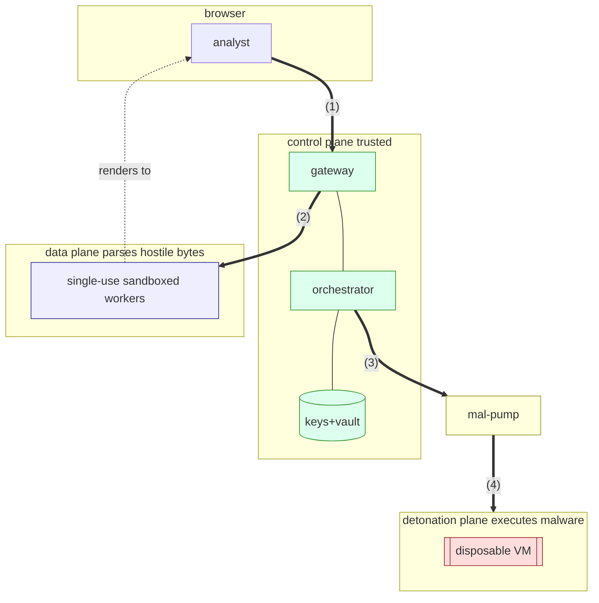
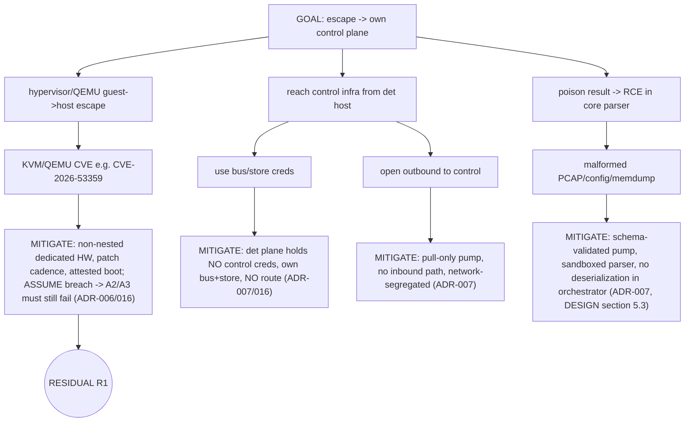
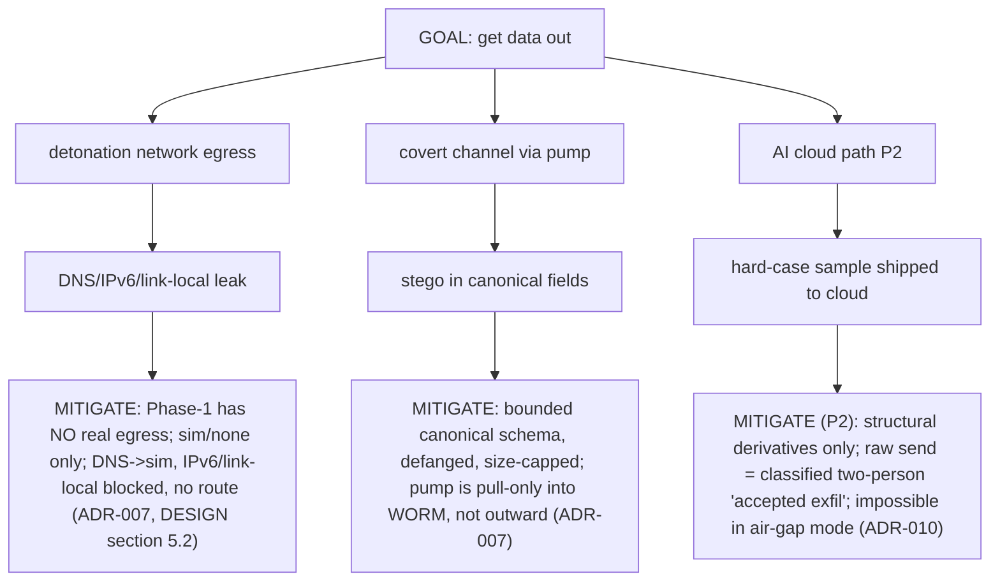
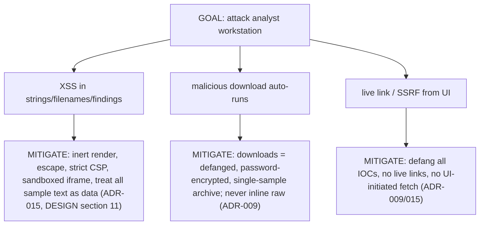
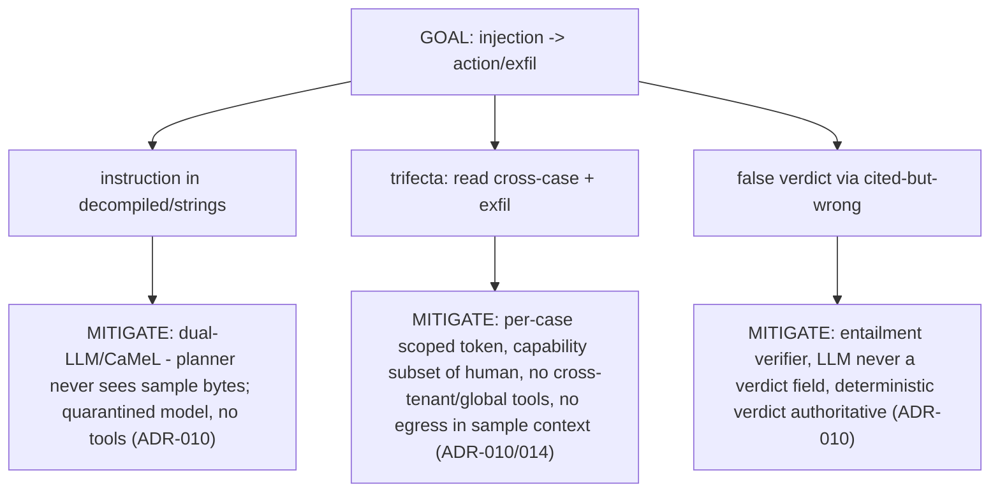
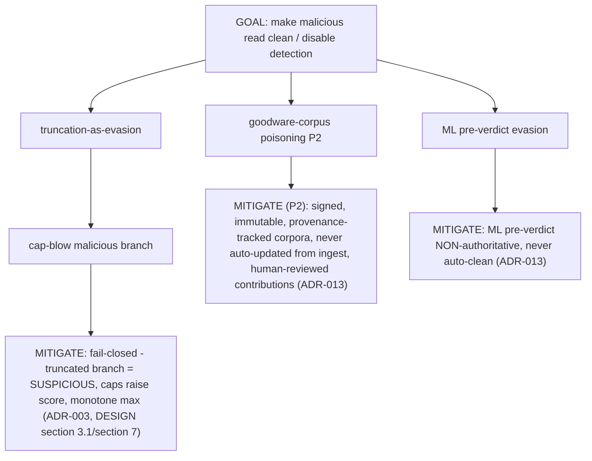

# MalAnalyzer - Threat Model (Phase-1 + forward-looking)

> Method: **STRIDE per trust boundary** + **attack trees** for the top attacker goals, each leaf mapped to a control and an owning ADR, with an honest **residual-risk register**. Scope centers on Phase-1 (`docs/PHASE1-TECHNICAL-DESIGN.md`) but flags Phase-2 surfaces (Tier-3, AI agent, multi-tenancy, cloud) so nothing is designed into a corner.
>
> **Honesty clause:** "no room for mistake" cannot mean "zero risk" - VM isolation is not absolute and prompt injection is not fully solvable. It means **no unaddressed or silent path**: every path below has a control or an explicitly owned residual, and the residuals name the external validation (pen test, red team, counsel) required to close them.
>
> **Round-2 update (`docs/DESIGN-AUDIT.md`).** A second adversarial audit added boundaries and residuals this model originally missed: the **VM management/lifecycle plane** (boundary (3) was drawn as the dispatch edge only), **host-forged canonical results** (verdict integrity A2 vs. a detonation escape), **pump compromise**, **cross-run poisoning**, and **all-in-one single-node having no escape-containment**. New residuals **R8-R12** are in `DESIGN-AUDIT.md section 6`; R1 is narrowed (its "reaches nothing" holds only for the separate-node topology). Attack trees G1/G2 should be read with those additions.

---

## 1. Assets, Actors, Boundaries

**Assets (what we protect):** (A1) the malware corpus & its encryption keys; (A2) verdict integrity; (A3) air-gap / data-confidentiality; (A4) the analyst workstation; (A5) platform & model supply chain; (A6) the audit trail; (A7 Phase-2) cross-tenant separation.

**Actors:** the **sample** (attacker-authored, the primary adversary - it is *input*, not a user); a **malicious submitter**; a **curious/compromised analyst**; a **network adversary**; a **supply-chain adversary**; (Phase-2) a **malicious tenant**.

**Trust boundaries:** (1) browser<->gateway; (2) control<->data plane; (3) **control<->detonation plane (the critical one)**; (4) the `mal-pump` mediation; (5) analyst-render boundary; (6) (Phase-2) AI quarantine boundary; (7) tenant boundary; (8) build/update supply chain.

---

> The rendered, audited diagram set is in **[`docs/diagrams/`](diagrams/README.md)** - diagram **02** is the trust-boundary catalog (this section, visualized), and **03** proves the detonation dead-end including the management-plane channels this model's Round-2 update added.

## 2. STRIDE by boundary (summary)

| Boundary | Top threats | Primary controls (ADR) |
|---|---|---|
| (1) browser<->gateway | Spoofing, elevation | OIDC, OPA default-deny, short tokens, no `alg=none`, audit (ADR-014/016) |
| (2) control<->data | Tampering, DoS, info-disclosure | single-use sandboxed workers, no-network namespace, cgroups, signed single-use fetch URLs (ADR-004/005) |
| (3) control<->detonation | **Escape->pivot, DoS, exfil** | dead-ended det plane (no route/creds), own bus+store, slot admission, disposable VMs, non-nested HW, attested boot (ADR-006/007/016) |
| (4) mal-pump | Malicious result payload -> RCE in core | pull-only, strict JSON-Schema validation, sandboxed parser, no complex deserialization (ADR-007) |
| (5) analyst render | XSS/homoglyph/CSRF, drive-by | inert render, defang, strict CSP, sandboxed iframes, single-sample encrypted downloads (ADR-009/015) |
| (6) AI quarantine (P2) | Prompt injection, trifecta exfil | dual-LLM/CaMeL, per-case scoped agent, entailment-verified, no egress in sample context (ADR-010) |
| (7) tenant (P2) | Cross-tenant read | hard isolation default, tenant-partitioned workers, RLS defense-in-depth (ADR-016) |
| (8) supply chain | Poisoned dep/image/model | attestations + witnessed signing, SBOM, reproducible builds, model provenance (ADR-020) |

---

## 3. Attack Trees (top goals)

### G1 - Sample escapes detonation and pivots into the trusted core

**Residual R1:** a same-run escape lands on a host that can reach *nothing* trusted, but the det host itself is compromised until reflash. Owned; requires **pen test / red-team** validation of the segregation and a firmware-reflash policy for bare-metal (Phase-2).

### G2 - Defeat the air-gap / exfiltrate

**Residual R2 (Phase-2):** the cloud-AI path is a deliberate, gated egress; its safety rests on data-classification discipline. Owned; air-gap deployments disable it at the network layer.

### G3 - Compromise the analyst via hostile content

**Residual R3:** interactive noVNC (Phase-1.5+) streams a live malware desktop - pixels are safe, control/clipboard bridges are not. Owned; bridges disabled with no per-session re-enable, channel mediated (ADR-015).

### G4 - Hijack the AI/agent (Phase-2)

**Residual R4 (Phase-2):** injection is not fully solvable; quarantine caps blast radius to "advisory," not "zero." Owned; **the entire AI layer is out of Phase-1**, so this risk ships only after the quarantine harness and its own adversarial eval exist.

### G5 - Poison a verdict / blind the platform

**Residual R5:** a novel evasion that produces no signal at all still under-scores - mitigated by fail-closed defaults (unknown != benign) and detonation, but zero-signal samples are an inherent limit of any analyzer. Owned; documented.

### G6 - Supply-chain compromise
Poisoned dependency, image, or **model weights** -> owned by ADR-020 (attestations, witnessed offline signing, SBOM, reproducible builds, model provenance/scanning, privileged-and-audited model swap). **Residual R6:** the transitive OSS surface is large (JVM later, dozens of Python engines); continuous SCA + pinned/vetted deps + the xz-utils lesson (watch maintainer takeovers) - never fully eliminable, actively managed.

---

## 4. Residual-Risk Register (ranked, owned)

| ID | Risk | Severity | Owner control | Needs |
|----|------|----------|---------------|-------|
| R1 | Detonation host compromise after guest escape | High | dead-ended plane; blast-radius only | **external pen test / red team**; bare-metal reflash policy |
| R6 | Transitive dependency / model supply chain | High | ADR-020 | continuous SCA; maintainer-risk watch |
| R2 | Cloud-AI gated egress (P2) | Med | classification + two-person | policy + air-gap network enforcement |
| R4 | AI injection residual (P2) | Med | quarantine caps to advisory | AI adversarial eval before ship |
| R3 | Interactive noVNC bridges (P1.5) | Med | bridges off, mediated | UX-security review |
| R5 | Zero-signal novel evasion | Med | fail-closed unknown!=benign | detonation + ongoing detection R&D |
| R7 | OpenBao/key DR incident | High | envelope enc + Shamir escrow | **tested restore drill** (M4) |

---

## 5. Assumptions & Required External Validation
- **Assumed:** the host OS/hypervisor is patched; operators follow the network-segregation deployment; OpenBao unseal custodians are trustworthy and separated.
- **Must be externally validated (not self-assertable):** (1) an independent **penetration test / red-team** of the detonation-escape -> pivot path (G1/R1) before any "most secure" claim; (2) **legal counsel** on the licensing model (`docs/LICENSING-BRIEF.md`); (3) a **tested DR restore** (R7); (4) an **AI adversarial evaluation** before the Phase-2 AI layer ships.
- **Explicitly not mitigated (owned limits):** absolute VM-escape prevention; full prompt-injection prevention; zero-signal-sample detection. These are inherent; we bound blast radius and fail closed, and we say so rather than pretending otherwise.
