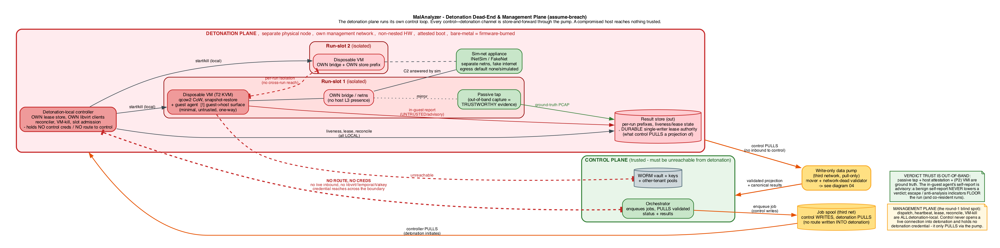
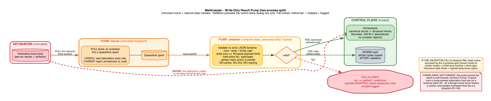
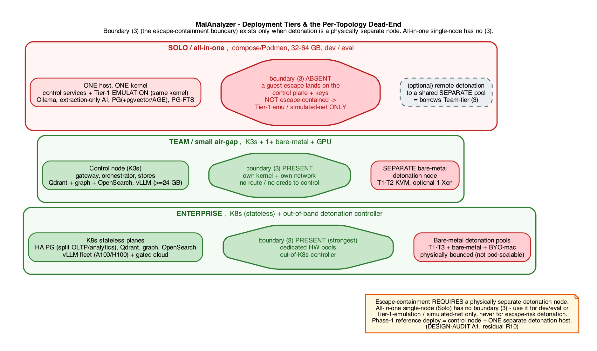

# MalAnalyzer - Canonical Architecture Diagrams

The authoritative, audited diagram set for MalAnalyzer. These are **rendered from committed Graphviz source** (`src/*.dot`) - chosen over cloud diagram tools deliberately: the source is plain text (diff-reviewable in PRs), the toolchain is a single binary, and the whole build is **fully air-gapped** (no network, no external fonts, no service), matching the platform's own deployment model.

Every diagram was drawn against the design **after** the round-2 adversarial audit (`../DESIGN-AUDIT.md`), so each depicts what is *true* - including, on diagram 08, where a trust boundary is deliberately **absent**. The rule for this set: **if a path isn't drawn, it isn't reachable.**

## Rebuild (air-gapped, reproducible)

```bash
./render.sh          # render every src/*.dot -> render/<name>.{svg,png}
./render.sh 03       # render only sources matching "03"
```

Requires only Graphviz (`dot`). SVG is the primary artifact (scales, crisp); PNG (144 dpi) is a universal fallback. Both are committed so the diagrams are viewable offline with zero toolchain.

## Visual language (consistent across the set)

| Element | Meaning |
|---|---|
| **Green** cluster/node | **Control plane** - trusted; never executes malware |
| **Blue** | **Data plane** - parses hostile bytes, no execution |
| **Red** | **Detonation plane** - executes malware; assume-breach; dead-ended |
| **Amber** | **Mediation** (the pump) / **fail-closed gates** - trusted by neither side |
| **Slate cylinder** | **Stores** (vault, Postgres, Valkey, ...) |
| **Purple** | **Analyst / browser** render sink |
| **Teal** | **AI quarantine** components (Phase-2) |
| **Solid edge** | An allowed data/control flow |
| **Dashed grey edge** | Phase-1.5 / Phase-2 (deferred) flow |
| **Orange edge** | Cross-plane flow **through the pump** (the only detonation<->control path) |
| **Red dashed edge, barred both ends** | A path that **structurally does not exist** (no route / no creds / no in-process import) - drawn to prove its absence |
| **Octagon** | A **fail-closed** decision point or a hard invariant |
| **`note` box** | A callout: an owned residual, a blast-radius bound, or an honesty caveat |

`(P2)` / `(P1.5)` in a label marks a component or flow deferred beyond Phase-1.

## The diagrams

| # | Diagram | What it proves / shows | Anchored to |
|---|---------|------------------------|-------------|
| 01 | [System planes & trust architecture](render/01-system-planes.svg) | The master map: three planes, every legitimate crossing, and the barred detonation->control path | ARCH section 1; ADR-001/006/007/016 |
| 02 | [Trust-boundary catalog](render/02-trust-boundaries.svg) | All 8 boundaries as cards - what crosses, direction, control (STRIDE) | THREAT-MODEL section 1-2 |
| 03 | [Detonation dead-end & management plane](render/03-detonation-deadend.svg) | Every control<->detonation channel is pull-only; per-run isolation; out-of-band verdict trust; guest-agent surface | ADR-006/007/016; DESIGN-AUDIT A2/A3/A9/A10/A15 |
| 04 | [Write-only result pump](render/04-result-pump-pipeline.svg) | Two-process split (mover + network-dead validator); fail-closed; parse-safe-not-honest; R8 blast radius | ADR-007; DESIGN-AUDIT A4/A11 |
| 05 | [Sample lifecycle (fail-closed gates)](render/05-dataflow-lifecycle.svg) | End-to-end flow with a fail-closed octagon at every gate; warranting fails toward dynamic | ARCH section 4; PHASE1 section 6; DESIGN-AUDIT A8 |
| 06 | [Verdict aggregation over the DAG](render/06-dag-aggregation.svg) | Worked diamond; monotone max over unique nodes; no input turns malicious->benign | ADR-003; PHASE1 section 3.1; DESIGN-AUDIT A2/A14 |
| 07 | [AI quarantine (dual-LLM/CaMeL)](render/07-ai-quarantine.svg) | Quarantine caps blast radius; planner authority is the control; absent tools drawn barred (P2) | ADR-010/014; DESIGN-AUDIT A13 |
| 08 | [Deployment tiers & per-topology dead-end](render/08-deployment-tiers.svg) | Boundary (3) exists only with a separate detonation node; all-in-one single-node has none | ADR-017; DESIGN-AUDIT A1 / R10 |
| 09 | [Licensing isolation](render/09-licensing-isolation.svg) | Apache core kept clean; transport per license class; bidirectional CI gate; no in-process import | ADR-019/004; DESIGN-AUDIT A7 |
| 10 | [Phase-1 components & data paths](render/10-phase1-components.svg) | Buildable Phase-1, corrected: workers hold no store creds (mounted fd / UDS); separate detonation host | PHASE1 section 1; DESIGN-AUDIT A1/A3/A5/A6 |
| 11 | [Supply chain & offline trust](render/11-supply-chain-offline.svg) | Reproducible builds + witnessed signing + offline revocation (leaked-key window bounded) | ADR-020; DESIGN-AUDIT A12 / R11 |

## Preview

> Rendered PNGs shown below; click any title above for the crisp SVG. Regenerate with `./render.sh`.

**01 - System planes & trust architecture**


**03 - Detonation dead-end & management plane**


**04 - Write-only result pump (two-process split)**


**08 - Deployment tiers & the per-topology dead-end**


---

*Diagrams are downstream of the docs. If a diagram and a source document disagree, the document (and, for round-2 changes, `../DESIGN-AUDIT.md`) is authoritative - fix the `.dot` and re-render. Keep the visual language above consistent when adding diagrams.*
